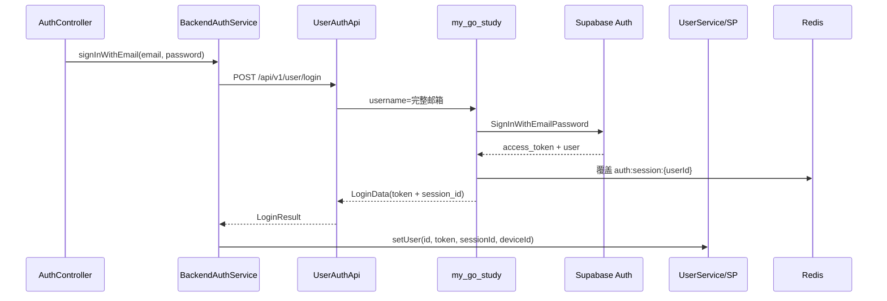

# Flutter ↔ my_go_study 后端交互说明

本文档描述当前工程中 **Flutter 客户端** 与 **Go 后端（my_go_study）** 的交互约定、认证链路与业务 API 接入方式。

> 工程运行与环境切换见 [USAGE_GUIDE.md](./USAGE_GUIDE.md)；模块结构见 [MODULE_ARCHITECTURE.md](./MODULE_ARCHITECTURE.md)。

---

## 1. 架构总览

### 1.1 数据流

```
┌─────────────┐     HTTP JSON      ┌──────────────┐     Supabase Auth/API     ┌─────────────┐
│ Flutter App │ ────────────────► │  my_go_study │ ────────────────────────► │  Supabase   │
│ (module_*)  │ ◄──────────────── │  (Go BFF)    │ ◄──────────────────────── │  PostgreSQL │
└─────────────┘   ResultModel     └──────────────┘   JWT + PostgREST/RLS    └─────────────┘
```

**原则**

- Flutter **不直连** Supabase SDK 做业务请求；认证与业务数据均经 Go BFF。
- Flutter 本地只保存 **Supabase access_token**（`UserService.currentUser.token`），后续请求由 `AuthHeaderProvider` 注入 `Authorization: Bearer <token>`。
- Go 后端负责：注册/登录代理 Supabase Auth、校验 JWT、访问 Supabase `transactions` / `profiles` 等表（RLS）。

### 1.2 分层（Feature 模块内）

```
Page / Widget
    ↓
Controller / ViewModel
    ↓
Repository          ← 解包 PageResult / 实体，处理 AuthFailure
    ↓
XxxApi              ← HttpManager + ResultModel converter
    ↓
HttpManager         ← Dio + BackendResponseParser + 拦截器
    ↓
my_go_study :8080
```

### 1.3 关键模块与文件

| 层级 | 包 / 路径 | 职责 |
|------|-----------|------|
| 壳工程启动 | `lib/main.dart` | `EnvironmentSession` → `AppHttpBootstrap` → `AuthSession` |
| HTTP 引导 | `packages/commons/network/lib/http/app_http_bootstrap.dart` | baseUrl、环境头、Parser |
| BaseUrl | `packages/commons/network/lib/http/backend_http_config.dart` | 环境 URL + 模拟器 localhost 映射 |
| 鉴权头 | `packages/commons/network/lib/http/auth_header_provider.dart` | Bearer token |
| 响应解析 | `packages/commons/network/lib/http/backend_response_parser.dart` | `{ code, message, data }` 信封 |
| 信封模型 | `packages/commons/network/lib/api/result_model.dart` | `ResultModel` / `ListData` / `PageResult` |
| 认证 API | `packages/features/auth/lib/api/user_auth_api.dart` | `/api/v1/user/login|register` |
| 认证服务 | `packages/features/auth/lib/session/backend_auth_service.dart` | 登录态持久化 |
| 会话 | `packages/features/auth/lib/session/auth_session.dart` | Mock / Backend 切换 |
| 业务示例 | `packages/features/home/lib/home/api/transaction_api.dart` | 二手车 transactions |

Go 后端仓库（独立）：`my_go_study`（默认 `http://127.0.0.1:8080`）。

---

## 2. 环境与 Base URL

### 2.1 Flutter 三套环境

配置在 [`packages/commons/core/lib/env/env_config.dart`](../packages/commons/core/lib/env/env_config.dart)：

| AppEnv | backendBaseUrl（默认） | 说明 |
|--------|------------------------|------|
| test | `http://127.0.0.1:8080` | 本地开发 |
| staging | `http://127.0.0.1:8080` | 预发（可按需改域名） |
| production | `https://api.xiaomaomain.com` | 线上 |

用户在 **设置页** 切换环境后，`EnvironmentService.onEnvChanged` 会触发 `AppHttpBootstrap.reinitialize()` 刷新 Dio baseUrl。

### 2.2 模拟器 / 真机 localhost

[`BackendHttpConfig`](../packages/commons/network/lib/http/backend_http_config.dart) 会自动映射：

| 平台 | 配置 `127.0.0.1:8080` 实际请求 |
|------|----------------------------------|
| iOS 模拟器 | `127.0.0.1:8080` |
| Android / 鸿蒙模拟器 | `10.0.2.2:8080` |
| 真机 | 需改为电脑 **局域网 IP**，如 `http://192.168.x.x:8080` |

### 2.3 请求头

| Header | 来源 | 说明 |
|--------|------|------|
| `Authorization` | `AuthHeaderProvider` | 已登录时 `Bearer <Supabase access_token>` |
| `X-Session-ID` | `AuthHeaderProvider` | 登录返回的 `session_id`（单设备校验） |
| `X-Device-ID` | `AuthHeaderProvider` | 本机 `device_id`（android id / iOS idfv） |
| `Content-Type` | Dio 默认 / Provider | `application/json` |
| `X-App-Env` | `EnvHeaderInterceptor` | **必须为 ASCII**：`test` / `staging` / `production`（不可用中文） |

### 2.4 本地配置文件

```bash
cp .env.example .env   # .env 须入库，团队共用
```

Flutter `.env` **仅含** `USE_MOCK_AUTH`（经 `--dart-define-from-file` 注入）。**不包含** Supabase URL/密钥；所有认证与业务请求经 Go BFF。

**Supabase 密钥仅配置在 Go 后端** `my_go_study/.env` 或 `configs/config.dev.yaml`、`SUPABASE_*` 环境变量。

---

## 3. 统一响应格式（ResultModel）

### 3.1 标准信封

Go 管理端接口（如登录、register、manage 列表）返回：

```json
{
  "code": 0,
  "message": "success",
  "data": { },
  "timestamp": 1704067200
}
```

- `code == 0` 表示成功。
- 失败时 `code != 0`，`message` 为可读文案；HTTP 状态码可能为 4xx/5xx。

### 3.2 Flutter 兼容格式（transactions 列表）

`GET /api/v1/transactions?limit=&offset=` 可直接返回：

```json
{ "items": [ ... ] }
```

或带信封的 `{ "code": 0, "data": { "list": [...] } }`。  
[`TransactionApi`](../packages/features/home/lib/home/api/transaction_api.dart) 的 converter **两种都支持**。

### 3.3 错误码（Go BFF）

| code | HTTP | 含义 | Flutter 映射 |
|------|------|------|----------------|
| 0 | 200 | 成功 | — |
| 10001 | 400 | 参数错误 | `WeakPasswordFailure` 等 |
| 10002 | 401 | 密码错误 | `InvalidCredentialsFailure` |
| 10003 | 404 | 账号未注册 | `AccountNotRegisteredFailure` |
| 10004 | 404 | 资源不存在 | — |
| 50000 | 500 | 服务器内部错误 | `UnknownAuthFailure` |

### 3.4 HTTP 层解析要点

- `AppHttpBootstrap` 设置 `validateStatus: status < 600`，**4xx/5xx 仍进入 `BackendResponseParser`**，从 JSON `message` 取中文错误，而不是仅用 `Internal Server Error`。
- 业务失败应抛 `HttpRequestException`；Repository / Api 层映射为 `AuthFailure` 或 UI 文案。

---

## 4. 认证链路

### 4.1 流程图



注册同理：`POST /api/v1/user/register` → Supabase Signup；若返回 `token` 则自动登录，否则需邮箱验证后再登录。

**单设备登录**：同一账号全局仅 1 个 mobile 会话。新设备登录后旧设备下次 API 返回 401「账号已在其他设备登录」；[`SessionGuardHook`](../packages/features/auth/lib/session/session_guard.dart) 自动登出并跳转登录页。

### 4.2 API 约定

#### 登录

```
POST /api/v1/user/login
Content-Type: application/json

{
  "username": "user@example.com",
  "password": "******",
  "device_id": "<android_id_or_idfv>",
  "platform": "ios"
}
```

> **username 必须为完整邮箱**；**platform** 仅 `android` / `ios`。

成功 `data`：

```json
{
  "token": "<supabase_access_token>",
  "session_id": "<uuid>",
  "user": {
    "id": "<uuid>",
    "username": "display_or_local_part",
    "email": "user@example.com"
  }
}
```

#### 注册

```
POST /api/v1/user/register

{
  "username": "昵称或邮箱前缀",
  "password": "******",
  "email": "user@example.com",
  "device_id": "<android_id_or_idfv>",
  "platform": "android"
}
```

- 密码最少 **6 位**（Flutter UI 与 Go/Supabase 一致）。
- 成功且 Supabase 返回 session 时，响应结构与登录相同（含 `token` + `session_id`）。
- 若项目开启邮箱验证，返回提示「请查收验证邮件后再登录」。

#### 刷新 Token（同设备续期 session）

```
POST /api/v1/user/refresh

{
  "refresh_token": "<supabase_refresh_token>",
  "device_id": "<stable_device_id>",
  "session_id": "<current_session_id>",
  "platform": "ios"
}
```

- `device_id` / `session_id` / `platform` 可选但 **推荐携带**；携带后服务端会在同设备上续期 Redis session 并返回最新 `session_id`。
- 同设备仅 `session_id` 过期时返回「会话无效」，客户端应走 refresh 恢复，**不应**视为其他设备互踢。
- 仅当 Redis 中活跃 `device_id` 与请求不一致时，返回 401「账号已在其他设备登录」。

成功 `data`：

```json
{
  "token": "<new_access_token>",
  "refresh_token": "<new_refresh_token>",
  "session_id": "<renewed_session_id>"
}
```

### 4.3 本地会话

登录成功后 [`BackendAuthService`](../packages/features/auth/lib/session/backend_auth_service.dart) 写入：

```dart
User(
  id: uuid,
  name: displayName,
  avatar: '',
  token: accessToken,
  sessionId: sessionId,
  deviceId: deviceId,
)
```

持久化键：`auth_user_session`（SharedPreferences，见 `UserServiceImpl`）。

业务请求由 `AuthHeaderProvider` 附加 `Authorization`、`X-Session-ID`、`X-Device-ID`。

登出：`AuthSession.logout()` → 清除 SP + `AuthService.signOut()`。

### 4.4 Mock 认证

`.env` 中 `USE_MOCK_AUTH=true` 时走 `MockAuthService`，**不请求 Go 后端**。联调 Supabase 链路时必须为 `false`。

### 4.5 登录拦截与回跳

需要登录的功能入口应使用统一模式（示例：二手车）：

```dart
// packages/features/home/lib/home/navigation/used_car_navigation.dart
if (AuthSession.isLoggedIn) {
  await Get.toNamed(RoutePath.homeUsedCarList);
} else {
  await AuthNavigation.openLogin(redirectRoute: RoutePath.homeUsedCarList);
}
```

- `AuthNavigation.openLogin`：modal 登录页（`Transition.downToUp`）。
- 登录成功后 `LoginRedirect` 自动跳回 `redirectRoute`。

---

## 5. 业务 API 示例：二手车（transactions）

### 5.1 接口

| 方法 | 路径 | 鉴权 | 说明 |
|------|------|------|------|
| GET | `/api/v1/transactions?limit=&offset=` | Supabase JWT | Flutter 列表（limit/offset） |
| GET | `/api/v1/transactions/:id` | Supabase JWT | 详情 |
| GET | `/api/v1/profiles/me` | Supabase JWT | 用户资料 |

Go 侧使用 **SupabaseAuth 中间件**校验 token，数据来自 Supabase `transactions` 表（需 RLS，见 [`supabase/migrations/003_transactions_user_id_rls.sql`](../supabase/migrations/003_transactions_user_id_rls.sql)）。

### 5.2 Flutter 调用链

```
UsedCarNavigation.open()
  → UsedCarListPage
  → UsedCarListController.load()
  → TransactionRepository.fetchPage()
  → TransactionApi.fetchPage(limit/offset)
  → HttpManager.get + AuthHeaderProvider(Bearer token)
```

### 5.3 分页约定

- Flutter Controller 使用 **0-based** `page`。
- API 层转换为 `offset = page * size`，`limit = size`（默认 20）。

### 5.4 常见错误

| 现象 | 原因 | 处理 |
|------|------|------|
| 401 未授权 | token 过期或未登录 | 重新登录 |
| 无法连接服务端 | Go 未启动或 baseUrl 错误 | 启动 `my_go_study`，检查模拟器 IP |
| 空列表 | Supabase 无数据 | 正常，非错误 |

---

## 6. Realtime WebSocket

Flutter 通过 `module_realtime` 连接 Go BFF WebSocket 网关（**不**使用 Supabase Realtime SDK）。

### 6.1 与 HTTP 的差异

| 项 | HTTP 业务 API | Realtime |
|----|---------------|----------|
| 响应格式 | `ResultModel { code, message, data }` | 直出 JSON 或 WS `RealtimeEnvelope` |
| 鉴权 | 每个请求带 Bearer token | 先 HTTP 换 ticket，WS 首帧 `auth` 消费 ticket |
| BaseUrl | `BackendHttpConfig` | ticket 返回 `wsUrl` + `BackendWsConfig` 平台映射 |

### 6.2 连接流程

```
1. POST /api/v1/realtime/ws-ticket   Authorization: Bearer <token>
2. WebSocket.connect(wsUrl)
3. 发送 { type: "auth", payload: { ticket } }
4. 收到 { type: "auth_ok" } → 已连接
5. 发送 { type: "sub", payload: { topics: ["sys.notify"] } }
6. auth_ok 后 HTTP POST /api/v1/realtime/sync 补拉断线期间事件
7. 每 25s 应用层 ping，10s 内须 pong（连续 2 次超时则重连）
```

登录成功后 `RealtimeInitializer` 会自动连接；默认订阅 `sys.notify`、`presence.bulk`。

### 6.3 HTTP 接口（Go BFF）

| 方法 | 路径 | 说明 |
|------|------|------|
| POST | `/api/v1/realtime/ws-ticket` | 换票，`{ platform, connId? }` → `{ ticket, wsUrl, expiresInSeconds, connId }` |
| POST | `/api/v1/realtime/sync` | `{ sinceSeq, topics? }` → `{ events[], latestSeq }` |
| POST | `/api/v1/realtime/push` | 开发推送 `{ title, body, topic?, name? }` → `{ envelope, delivered }` |
| GET | `/realtime/v1/connect` | WebSocket 升级 |

### 6.4 WS 消息类型（RealtimeEnvelope）

| type | 方向 | 说明 |
|------|------|------|
| `auth` / `auth_ok` | 双向 | 换票鉴权 |
| `sub` / `unsub` / `ack` | 客户端发起 | 主题订阅 |
| `ping` / `pong` | 客户端发起 | 应用层心跳（pong 回显 ping 的 `id`） |
| `event` | 服务端 → 客户端 | 业务事件，如 `sys.notify.show` |
| `error` | 服务端 → 客户端 | 鉴权失败等，随后关闭 WS |

**sys.notify 事件 payload 示例：**

```json
{
  "name": "sys.notify.show",
  "notifyId": "uuid",
  "title": "标题",
  "body": "正文"
}
```

App 内由 `GlobalNotifyHandler` 展示顶部 Banner；`notifyId` 去重。

### 6.5 Flutter 配置与代码

| 配置 | 文件 | 说明 |
|------|------|------|
| `useMockGateway = false` | `realtime_config.dart` | 连真实 Go WS |
| `wsBaseUrl` | `env_config.dart` | 参考地址；实际用 ticket.wsUrl |
| 模拟器 | `backend_ws_config.dart` | `127.0.0.1` → `10.0.2.2` |

```dart
final client = Get.find<AppRealtimeClient>();

// 监听连接状态
client.connectionState.listen((s) => debugPrint(s.label));

// 订阅 + 监听
await client.subscribeTopics([RealtimeTopics.sysNotify]);
client.watchEvents(eventName: 'sys.notify.show').listen((e) {
  debugPrint('${e.payload['title']}: ${e.payload['body']}');
});

// 发送客户端事件
await client.sendEvent(
  topic: RealtimeTopics.presenceBulk,
  eventName: 'presence.report',
  payload: {'status': 'online'},
);
```

**调试页**：Debug 模式 → 设置 → **Realtime / WebSocket 调试**（`/settings/realtime_debug`）。

### 6.6 联调命令

```bash
# Go 仓库
cd my_go_study && make run          # 终端 1
make test-realtime                  # 终端 2

# 手动推送（需 TOKEN）
curl -X POST http://127.0.0.1:8080/api/v1/realtime/push \
  -H "Authorization: Bearer $TOKEN" \
  -H "Content-Type: application/json" \
  -d '{"title":"测试","body":"Hello"}'
```

**完整协议文档**（含 curl / Python 示例、心跳时序、关闭码）：Go 仓库 [docs/realtime-websocket.md](../../my_code_study/my_go_study/docs/realtime-websocket.md)

### 6.7 关键文件

| 文件 | 职责 |
|------|------|
| `packages/infrastructure/realtime/lib/client/app_realtime_client_impl.dart` | 连接、auth、sync、重连 |
| `packages/infrastructure/realtime/lib/api/ws_ticket_api.dart` | 换票 HTTP |
| `packages/infrastructure/realtime/lib/api/ws_sync_api.dart` | 同步 HTTP |
| `packages/infrastructure/realtime/lib/connection/heartbeat_scheduler.dart` | ping/pong |
| `packages/infrastructure/realtime/lib/handlers/global_notify_handler.dart` | 通知 Banner |
| `packages/commons/network/lib/http/backend_ws_config.dart` | WS URL 平台映射 |

---

## 7. 启动 Go 后端（my_go_study）

```bash
cd /path/to/my_go_study
APP_ENV=dev go run ./cmd/api
# 默认监听 :8080
```

推荐环境变量（`configs/config.dev.yaml` 或 export）：

| 变量 | 说明 |
|------|------|
| `SUPABASE_URL` | Supabase Project URL |
| `SUPABASE_ANON_KEY` | anon / publishable key |
| `SUPABASE_SERVICE_ROLE_KEY` | 可选；用于区分「未注册」与「密码错误」 |

验证：

```bash
curl http://127.0.0.1:8080/health

curl -X POST http://127.0.0.1:8080/api/v1/user/login \
  -H "Content-Type: application/json" \
  -d '{"username":"you@example.com","password":"your_password"}'
```

---

## 8. 新增业务 API 检查清单

1. **Go**：在 `my_go_study` 增加 handler，需登录接口挂 `SupabaseAuth` 中间件。
2. **Flutter 模型**：`packages/features/<module>/lib/.../model/` 定义 `fromJson`。
3. **Flutter Api**：`HttpManager.get/post<ResultModel<T>>`，converter 用 `ResultModel.listPage` 或 `ResultModel.object`。
4. **Repository**：解包 `result.data`，不要向 UI 暴露 `ResultModel`。
5. **HttpConfig**：模块内 `XxxHttpConfig.ensureInitialized()` 调用 `AppHttpBootstrap.reinitialize`（与 [`AuthHttpConfig`](../packages/features/auth/lib/api/auth_http_config.dart) 相同模式）。
6. **需登录入口**：`AuthSession.isLoggedIn` + `AuthNavigation.openLogin(redirectRoute: ...)`。
7. **Obx / 列表**：遵循 [AGENTS.md](../AGENTS.md) GetX 规范。

---

## 9. 调试技巧

1. **开启 HTTP 日志**：壳工程 `AppHttpBootstrap.initialize(enableLog: kDebugMode)` 已启用 Dio 日志。
2. **看请求头**：确认 `X-App-Env: test`、`Authorization: Bearer eyJ...`。
3. **区分网络层 / 业务层错误**：`HttpRequestException.message` 应显示中文 `message` 字段。
4. **Auth 日志**：`AuthController` 输出 `[AuthLogin]` / `[AuthRegister]` 前缀日志。
5. **完整重启**：修改 `.env` 或 baseUrl 后需 **Hot Restart**，不是 Hot Reload。

---

## 10. 相关文档

- [USAGE_GUIDE.md](./USAGE_GUIDE.md) — 运行、环境、登录 UI 流程
- [MODULE_ARCHITECTURE.md](./MODULE_ARCHITECTURE.md) — 模块边界与 DI
- [AGENTS.md](../AGENTS.md) — Agent 陷阱（Obx、HTTP、鸿蒙、视频沉浸式）
- Go [认证初学者导读](../../my_code_study/my_go_study/docs/auth-beginner-walkthrough.md)
- Go [Transactions 初学者导读](../../my_code_study/my_go_study/docs/transactions-beginner-walkthrough.md)
- Go [Realtime 初学者导读](../../my_code_study/my_go_study/docs/realtime-beginner-walkthrough.md)
