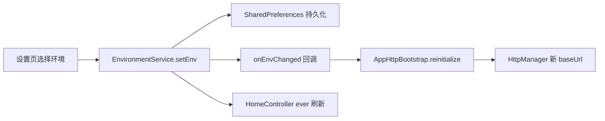

# Flutter 模块化工程 — 使用与运行指南

本文档基于当前工程实践，涵盖：**壳工程运行**、**业务模块独立运行**、**三套环境切换**、**登录与用户状态**、**Git Worktree 并行开发** 等日常开发场景。

> 架构设计详见 [MODULE_ARCHITECTURE.md](./MODULE_ARCHITECTURE.md)。  
> **Flutter ↔ Go 后端 ↔ Supabase 交互**（API、认证、ResultModel、调试）详见 [BACKEND_INTEGRATION.md](./BACKEND_INTEGRATION.md)。  
> **Git Markdown → 飞书 Wiki 同步**详见 [FEISHU_SYNC.md](./FEISHU_SYNC.md)。

---

## 1. 工程概览

```
module_sample/                 # 壳工程（完整 App）
├── lib/main.dart              # 启动入口 + 全局 DI
├── lib/config/module_manifest.dart
├── packages/
│   ├── core/                  # 契约：User、AuthService、AppLoading、EnvironmentService
│   ├── network/               # Dio + AppHttpBootstrap + ResultModel
│   ├── route/                 # FeatureModule、Registry、独立运行 Runner
│   ├── storage/               # sqflite、AppSettings
│   ├── toolkit/               # 工具封装（Log/SP/CacheImage/Svg/Lottie…）
│   ├── ui/                    # 主题、UiKit、BaseViewModel
│   └── features/              # 业务模块
│       ├── auth/ home/ settings/ chat/ …
└── scripts/run_module.sh
```

### 1.1 核心服务（GetX DI）

| 服务 | 注册位置 | 说明 |
|------|----------|------|
| `AuthService` | `AuthSession.register()` | 登录/注册/登出；Mock 或 BackendAuthService（Go → Supabase） |
| `UserService` | `AuthSession.register()` | 登录态快照；业务模块只读 |
| `EnvironmentService` | `EnvironmentSession.register()` | 测试/预发/线上；实现在 settings 模块 |
| `AppLoading` | 壳工程 `main.dart`（`UiKitInitializer.initialize()`） | 全局 Loading / Toast；业务通过接口调用 |
| `WebBridgeRegistry` | 壳工程 `main.dart`（`WebKitInitializer.initialize()`） | H5 ↔ Flutter 桥接；各模块注册 action handler |
| `AppController` | `AppBinding` | 主题、语言、沉浸式 |

业务模块通过 `Get.find<UserService>()` / `Get.find<EnvironmentService>()` 获取，**不要**自行 `new` 实现类。

---

## 2. 壳工程运行（完整 App）

### 2.1 首次运行

```bash
cd /path/to/flutter_module_sample
cp .env.example .env   # 仅需 USE_MOCK_AUTH 开关
flutter pub get
./scripts/run_app.sh   # 或 flutter run --dart-define-from-file=.env
```

> 真实登录联调：`USE_MOCK_AUTH=false`，并启动 Go 后端 `my_go_study`（默认 `http://127.0.0.1:8080`）。Supabase 密钥配置在 Go 后端，不在 Flutter。

> 数据库迁移 SQL 见 [`supabase/migrations/`](../supabase/migrations/)（由 Go 后端连接 Supabase 使用）。

### 2.2 启动流程

```
main()
  → ModuleUtilsInitializer（日志、SP、ScreenUtil）
  → SpManager / AppDatabase
  → AuthSession.register（AuthService + UserService；Go 后端或 Mock）
  → UiKitInitializer.initialize（AppLoading + EasyLoading 配置）
  → WebKitInitializer.initialize（WebBridgeRegistry + 内置 handler）
  → EnvironmentSession.register（settings 模块，恢复环境）
  → ModuleRegistry.bootstrap（各模块 HTTP 等）
  → AppHttpBootstrap.initialize（全局 Dio）
  → AppBinding + 各模块 Binding
  → Debug：DoKit.runApp(DoKitApp(App))；Profile/Release：runApp(App)
  → GetMaterialApp.builder 内 UiKitInitializer.appBuilder
```

**DoKit（仅 Debug）**：`flutter run --debug` 启动后可见悬浮调试球；鸿蒙端若原生插件不兼容会自动降级为普通 `runApp`（设置页调试入口仍可用）。

### 2.3 页面分流

| 场景 | 路径 |
|------|------|
| Splash | `/` → 始终进入 `/main`（游客模式） |
| 游客 | `/main` 可浏览首页/聊天/我的；点 **社区** Tab 跳转登录 |
| 登录 | `/login` → **邮箱** 密码页 / **手机** 验证码页 |
| 注册 | `/register`（邮箱+密码 / 手机+短信） |
| 已登录 | `/main`（Tab：首页 / 聊天 / 社区 / 我的） |
| 设置 | `/settings`（含环境切换） |
| 学习报告 | 首页入口 → `/home/learning_report` |

### 2.4 登录与登出

**登录（双通道）**

1. **邮箱 + 密码**：登录页选「邮箱登录」→ 输入邮箱 → 密码页登录
2. **手机 + 短信验证码**：登录页选「短信登录」→ 输入手机号 → 获取验证码 → 输入 6 位 OTP

**注册**

- **邮箱注册**：`/register` → 邮箱 Tab → 邮箱 + 密码
- **手机注册**：`/register` → 手机 Tab → 短信验证码（首次验证自动建号）

> **测试环境固定账号**：手机号 `13400000000`，验证码 `123456`。
> - `USE_MOCK_AUTH=true`：本地 Mock，不请求 Go
> - `USE_MOCK_AUTH=false`：走 Go dev bypass，返回真实 Supabase token（需 `make run` + `service_role`）
> 生产环境真实 SMS 尚未开放。

**登出 / 登录**

- 主页 AppBar：已登录显示 **退出**；游客显示 **登录**
- 登出调用 `AuthSession.logout()` → 跳转登录页

> `AuthController` 使用 `lazyPut(..., fenix: true)`，登出后再次进入登录页可自动重建。

### 2.5 启用 / 禁用模块

编辑 [`lib/config/module_manifest.dart`](../lib/config/module_manifest.dart)：

1. 注释对应 `import`
2. 注释 `buildEnabledModules()` 中的模块实例

主工程即可在不引用该模块的情况下编译运行。

---

## 3. 业务模块独立运行

各业务模块已具备 **android/**、**ios/** 工程，可在模块目录内直接 `flutter run`。

### 3.1 支持独立运行的模块

| 模块 | 目录 | 入口 | 说明 |
|------|------|------|------|
| 登录 | `features/auth` | `lib/main_dev.dart` | `USE_MOCK_AUTH=true`，Mock 认证 |
| 首页 | `module_home` | `lib/main_dev.dart` | 注入 Mock 用户 + 默认环境 |
| 我的/设置 | `module_settings` | `lib/main_dev.dart` | 注入 Mock 用户 + 默认环境 |
| 聊天 | `module_chat` | `lib/main_dev.dart` | 基础 Runner |
| 社区 | `module_community` | `lib/main_dev.dart` | 基础 Runner |

### 3.2 方式一：模块目录内运行

```bash
cd module_auth
flutter pub get
flutter run                    # 默认 lib/main.dart → 转发 main_dev
# 或
flutter run -t lib/main_dev.dart
```

各模块 dev 包名不同，可同时安装到同一设备：

- `com.modulesample.auth_dev`
- `com.modulesample.home_dev`
- `com.modulesample.settings_dev`
- …

### 3.3 方式二：根目录脚本

```bash
./scripts/run_module.sh auth
./scripts/run_module.sh home
./scripts/run_module.sh mine        # 即 module_settings
./scripts/run_module.sh chat -d ios # 指定设备
```

### 3.4 方式三：壳工程指定入口

壳工程已有 android/ios 时，也可：

```bash
flutter run -t module_home/lib/main_dev.dart
```

### 3.5 独立运行原理

[`ModuleStandaloneRunner`](../module_route/lib/module/module_standalone_runner.dart) 统一处理：

```dart
ModuleStandaloneRunner.run(
  HomeModule(),
  config: ModuleStandaloneConfig(
    injectMockUser: true,              // MockUserService
    injectDefaultEnvironment: true,    // DefaultEnvironmentService（内存，不持久化）
    enableHttpLog: true,
    onSetup: () async { /* 模块特有初始化 */ },
  ),
);
```

| 配置项 | 作用 |
|--------|------|
| `injectMockUser` | 注入 `MockUserService`，无需真实登录 |
| `injectDefaultEnvironment` | 注入内存版环境服务（默认测试环境） |
| `onSetup` | 如 Auth 模块设置 `AuthController.standaloneMode = true` |

---

## 4. 三套环境（测试 / 预发 / 线上）

### 4.1 环境定义

| 枚举 | 显示名 | 用途 |
|------|--------|------|
| `AppEnv.test` | 测试 | 开发联调 |
| `AppEnv.staging` | 预发 | 预发布验证 |
| `AppEnv.production` | 线上 | 生产环境 |

配置位于 [`module_core/lib/env/env_config.dart`](../module_core/lib/env/env_config.dart)：

```dart
static const configs = {
  AppEnv.test: EnvConfig(
    baseUrl: 'https://www.wanandroid.com/',
    label: '测试',
  ),
  AppEnv.staging: EnvConfig(
    baseUrl: 'https://staging-api.yourcompany.com/',  // ← 替换预发域名
    label: '预发',
  ),
  AppEnv.production: EnvConfig(
    baseUrl: 'https://api.yourcompany.com/',          // ← 替换线上域名
    label: '线上',
  ),
};
```

### 4.2 壳工程如何切换

1. 登录 App → 进入 **我的** Tab → 路由 `/settings`（或通过设置入口）
2. 点击 **运行环境**
3. 选择 **测试 / 预发 / 线上**

切换后：

- 写入 `SharedPreferences`（键：`core_app_env`）
- 触发 `EnvironmentService.onEnvChanged`
- `AppHttpBootstrap.reinitialize()` 重建 `HttpManager`（更新 `baseUrl`）
- 请求头自动带上 `X-App-Env: 测试|预发|线上`
- 首页 `HomeController` 监听环境变化并刷新数据

### 4.3 代码中读取当前环境

```dart
import 'package:get/get.dart';
import 'package:module_core/core.dart';

// 当前 baseUrl
final baseUrl = Get.find<EnvironmentService>().baseUrl;

// 当前环境枚举
final env = Get.find<EnvironmentService>().currentEnv.value;

// 不依赖 GetX 时（Repository 层）
import 'package:module_http/module_http.dart';
final url = AppHttpBootstrap.resolveBaseUrl();
```

### 4.4 新增模块接入环境

1. HTTP 初始化改用 `AppHttpBootstrap.initialize()`，不要硬编码 `baseUrl`
2. 若需切换后刷新 UI，在 Controller 中：

```dart
ever(Get.find<EnvironmentService>().currentEnv, (_) => reloadData());
```

3. 独立运行时在 `main_dev.dart` 开启 `injectDefaultEnvironment: true`

### 4.5 环境切换链路



---

## 5. 依赖注入最佳实践

### 5.1 壳工程注册（唯一创建点）

```dart
await AuthSession.register(); // 读取 .env 中 USE_MOCK_AUTH
await Get.putAsync<EnvironmentService>(EnvironmentServiceImpl.create, permanent: true);
```

### 5.1.1 认证开关（`.env`）

| 变量 | 说明 |
|------|------|
| `USE_MOCK_AUTH` | `true` Mock 本地登录；`false` 经 Go 后端真实登录 |

```bash
flutter run --dart-define-from-file=.env
```

> Flutter **不配置、不直连** Supabase；`SUPABASE_*` 密钥仅在 Go 后端 `my_go_study` 中配置。

### 5.2 业务模块只依赖接口

```dart
final UserService _userService = Get.find<UserService>();
final EnvironmentService _env = Get.find<EnvironmentService>();
```

### 5.3 模块 Binding

```dart
class HomeBinding extends Bindings {
  @override
  void dependencies() {
    Get.lazyPut<HomeController>(HomeController.new);
  }
}
```

### 5.4 core.dart 导出边界

[`module_core/lib/core.dart`](../module_core/lib/core.dart) **只导出**：

- `User` / `UserService` / `AuthService` / `AuthFailure`
- `AppAuthConfig`
- `AppLoading`
- `AppEnv` / `EnvConfig` / `EnvironmentService`
- `MockUserService` / `MockAuthService` / `DefaultEnvironmentService`（dev 用）

**不导出** `UserServiceImpl`（在 auth 模块）。

---

## 5.5 Loading 与下拉刷新（UiKit）

### 架构

| 层级 | 模块 | 内容 |
|------|------|------|
| 契约 | `module_core` | `AppLoading` 抽象 |
| 实现 | `module_common_ui/kit/` | `EasyLoadingAppLoading`、`AppRefreshView`、`UiKitInitializer` |
| 壳接入 | `lib/main.dart` + `lib/app/app.dart` | `initialize()` + `appBuilder()` |
| 业务示例 | `module_home` | 首页首次 Loading + 下拉刷新 |

业务模块 **不要** 直接 `import flutter_easyloading` / `flutter_easyrefresh`，只依赖 `module_common_ui` 与 `module_core`。

### 壳工程接入（已完成）

```dart
// lib/main.dart
await UiKitInitializer.initialize();

// lib/app/app.dart — GetMaterialApp.builder
builder: UiKitInitializer.appBuilder(
  inner: (context, child) => ModuleUtilsInitializer.wrapApp(
    builder: (_, __) => child ?? const SizedBox.shrink(),
  ),
),
```

### 模块 pubspec

```yaml
dependencies:
  module_common_ui:
    path: ../module_common_ui
  module_core:
    path: ../module_core
```

### Controller：区分「首次加载」与「下拉刷新」

推荐策略（Home 模块已采用）：

| 场景 | Loading 方式 |
|------|----------------|
| 首次进入 / 错误重试 | `AppLoading.run(..., message: '加载中')` 全局遮罩 |
| 下拉刷新 / 静默刷新 | `runAsync` 或普通 await，**不**调 `AppLoading` |
| 加载失败 | 保留页面内错误 UI + 重试按钮（不用 `showError` toast） |

```dart
class HomeController extends BaseViewModel {
  HomeController({AppLoading? loading})
      : _loading = loading ?? Get.find<AppLoading>();

  final AppLoading _loading;

  Future<void> _loadInitial() async {
    await _loading.run(
      () async {
        errorMessage.value = null;
        try {
          dashboard.value = await _repository.loadDashboard();
        } catch (error) {
          errorMessage.value = error.toString();
        }
      },
      message: '加载中',
    );
  }

  Future<void> refreshDashboard() async {
    await runAsync(() async {
      dashboard.value = await _repository.loadDashboard();
    });
  }

  Future<void> retryInitialLoad() => _loadInitial();
}
```

也可使用静态门面：`UiKitInitializer.loading.run(...)`（与 `Get.find<AppLoading>()` 等价）。

### View：AppRefreshView 包裹滚动区域

```dart
return AppRefreshView(
  onRefresh: controller.refreshDashboard,
  child: CustomScrollView(
    slivers: [ /* ... */ ],
  ),
);
```

- 不需要上拉加载时 **不要** 传 `enableLoad`（默认 `false`）。
- 首次加载中且尚无数据时，页面 body 可返回 `SizedBox.shrink()`，由全局 EasyLoading 负责展示。

### 独立运行（module_home 示例）

```dart
// module_home/lib/main_dev.dart
ModuleStandaloneConfig(
  onSetup: () async => UiKitInitializer.initialize(),
  innerAppBuilder: UiKitInitializer.wrapChild,
  // ...
)
```

未调用 `UiKitInitializer.initialize()` 时，独立运行模块内 `AppLoading` 为 Noop，全局 Loading 不生效。

### 替换第三方库

只需修改 `module_common_ui/lib/kit/` 内：

- `easy_loading_service.dart`（Loading 实现）
- `app_refresh_view.dart`（Refresh 封装）

业务模块代码无需改动。

业务模块 **不要** 直接 `import cached_network_image` 等第三方库，统一使用 `commons/toolkit` 封装：

```dart
import 'package:module_utils/module_utils.dart';

CacheImageUtils.network(url, width: 48.w, height: 48.w, fit: BoxFit.cover);
CacheImageUtils.circle(avatarUrl, size: 56);
```

---

## 5.6 WebView 与 H5 桥接（WebKit）

### 分层（方案 C）

| 层级 | 说明 |
|------|------|
| **Core action** | `WebBridgeActions.coreActions`，壳工程 `WebKitCoreHandlers` **统一注册** |
| **Module action** | `WebBridgeActions.moduleActions`，各模块 `onRegister` 用 `registerModule` **扩展** |
| **常量表** | `commons/core/lib/web/web_bridge_actions.dart`，新增 action 先在此声明 |

### Action 常量表

| 常量 | 类型 | 说明 |
|------|------|------|
| `showToast` | Core | 全局 Toast |
| `closeWithResult` | Core | 关闭 Web 页并回传结果 |
| `getEnvironment` | Core | 读取当前环境 |
| `switchEnvironment` | Core | 切换环境 |
| `getUserInfo` | Core | 读取登录用户 |
| `refreshDashboard` | Module (home) | 刷新首页数据 |

业务模块 **禁止** 用 `registerModule` 注册 Core action（运行时会抛错）。

### 启动注册

```dart
// lib/main.dart
await WebKitInitializer.initialize();
WebKitCoreHandlers.register(webRegistry);  // Core 统一注册
await ModuleRegistry.bootstrap(hostContext); // 各模块 registerModule 扩展
```

### 打开 H5（推荐 Get 命名路由）

```dart
import 'package:get/get.dart';
import 'package:module_common_ui/module_common_ui.dart';
import 'package:module_route/route/route_path.dart';

Get.toNamed(
  RoutePath.web,
  arguments: WebPageConfig.asset(
    assetPath: WebBridgeAssets.testBridge,
    title: 'Web 桥接测试',
    showAppBar: true,
    params: {'storeName': 'xxx'},
    // 默认注入 WebBridgeAssets.icsAppInjection，通常无需手动配置。
    // bridgeScriptAssetPath: null, // H5 自带 bridge 时可关闭默认注入。
  ),
);

// 远程 URL、全屏 H5
Get.toNamed(
  RoutePath.web,
  arguments: WebPageConfig.url(
    url: 'https://example.com',
    showAppBar: false,
    params: {'token': 'xxx'},
  ),
);
```

> `WebNavigator` 已标记 `@Deprecated`，请统一使用 `Get.toNamed(RoutePath.web, ...)`。

### 模块扩展 handler

```dart
// 1. 先在 WebBridgeActions 声明 moduleActions
static const myAction = 'myAction';

// 2. 模块 onRegister 注册
registry.registerModule(WebBridgeActions.refreshDashboard, (message) async {
  await Get.find<HomeController>().refreshDashboard();
  return {'ok': true};
});
```

### H5 调用约定

```javascript
window.ICSJavascriptBridge.invoke('showToast', { text: 'Hello' });
```

Flutter 注入参数：`window.__FLUTTER_PARAMS__`，事件：`flutterReady`。

测试入口：首页 **销售顾问** → `assets/web/test_bridge.html`。
默认注入脚本：`assets/web/ICSAPPInjection.js`。

### 替换 flutter_inappwebview

只需修改 `commons/ui/lib/kit/web/` 内实现；Core/Module action 常量表与 H5 协议不变。

---

## 6. Git Worktree 并行开发

适用于多模块同时开发、减少分支切换冲突。

### 6.1 创建 worktree

```bash
# .worktrees/ 已在 .gitignore 中
git worktree add .worktrees/feature-auth -b feat/auth-login-ui
git worktree add .worktrees/feature-home -b feat/home-dashboard-ui
```

### 6.2 文件所有权（避免 merge 冲突）

| 分支 | 允许修改 |
|------|----------|
| auth | `module_auth/**`、`module_route/route_path.dart`（路由常量） |
| home | `module_home/**` |
| 共享 | `module_core/**`、壳工程 `lib/**` 应在 main 先合入 |

### 6.3 合并顺序建议

```
main（DI + 环境基础）
  → merge feat/auth-login-ui
  → merge feat/home-dashboard-ui
  → flutter analyze 全量验证
```

### 6.4 清理

```bash
git worktree remove .worktrees/feature-auth
git branch -d feat/auth-login-ui
```

---

## 7. 常见问题

### Q1：跳转密码页 Column overflow？

密码页/登录页已使用 `SingleChildScrollView` + 键盘 inset。若仍溢出，检查是否在固定高度容器内嵌套了不可滚动 Column。

### Q2：登出后报 `AuthController not found`？

已修复：`AuthBinding` 使用 `fenix: true`；登出前会补注册 Binding。

### Q3：模块独立运行报 `UserService` / `EnvironmentService` not found？

在 `main_dev.dart` 的 `ModuleStandaloneConfig` 中开启：

```dart
injectMockUser: true,
injectDefaultEnvironment: true,
```

### Q4：Android 构建失败 `NDK not installed`？

在 Android Studio → SDK Manager → SDK Tools 安装 **NDK (Side by side)**，与代码无关。

### Q5：切换环境后接口仍走旧域名？

确认 HTTP 初始化走的是 `AppHttpBootstrap`，且壳工程已绑定 `onEnvChanged → reinitialize`。可在 Charles/日志中查看请求 URL 与 `X-App-Env` 头。

### Q6：首页快捷卡片 overflow？

`HomeQuickActionGrid` 的 `childAspectRatio` 已调整为 `1.15`；副标题使用 `Expanded` 自适应。

---

## 8. 命令速查

```bash
# 壳工程
flutter pub get && flutter run

# 模块独立
cd module_auth && flutter run
./scripts/run_module.sh home

# 静态分析
flutter analyze lib/ module_core/ module_auth/lib/ module_home/lib/

# 查看 worktree
git worktree list

# 环境相关：修改域名后无需清缓存，App 内切换即可；首次改代码需 hot restart
```

---

## 9. 相关文件索引

| 用途 | 路径 |
|------|------|
| 壳工程启动 | `lib/main.dart` |
| 模块清单 | `lib/config/module_manifest.dart` |
| 环境配置 | `module_core/lib/env/env_config.dart` |
| 环境服务实现 | `features/settings/lib/env/environment_service_impl.dart` |
| HTTP 统一初始化 | `commons/network/lib/http/app_http_bootstrap.dart` |
| 工具模块 | `commons/toolkit/lib/utils/cache_image_utils.dart` |
| WanAndroid 遗留演示 | `features/home/lib/legacy/wanandroid/` |
| 环境切换 UI | `module_settings/lib/settings/view/settings_page.dart` |
| 独立运行 Runner | `module_route/lib/module/module_standalone_runner.dart` |
| 登录 Controller | `module_auth/lib/user/controller/auth_controller.dart` |
| UiKit 入口 | `module_common_ui/lib/kit/ui_kit_initializer.dart` |
| AppLoading 契约 | `module_core/lib/service/app_loading.dart` |
| Home Loading/Refresh 示例 | `module_home/lib/home/controller/home_controller.dart` |
| 路由常量 | `module_route/lib/route/route_path.dart` |
| 模块运行脚本 | `scripts/run_module.sh` |

---

## 10. 推荐阅读顺序

1. 本文档 — 日常运行与环境切换
2. [MODULE_ARCHITECTURE.md](./MODULE_ARCHITECTURE.md) — 模块分层、FeatureModule、MVVM 规范
3. 各模块 `lib/main_dev.dart` — 独立运行示例
