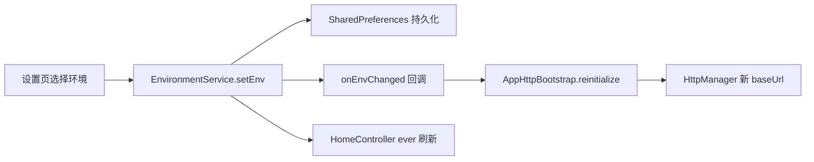

# Flutter 模块化工程 — 使用与运行指南

本文档基于当前工程实践，涵盖：**壳工程运行**、**业务模块独立运行**、**三套环境切换**、**登录与用户状态**、**Git Worktree 并行开发** 等日常开发场景。

> 架构设计详见 [MODULE_ARCHITECTURE.md](./MODULE_ARCHITECTURE.md)。

---

## 1. 工程概览

```
module_sample/                 # 壳工程（完整 App）
├── lib/main.dart              # 启动入口 + 全局 DI
├── lib/config/module_manifest.dart   # 模块启用清单
├── module_core/               # 共享：User、EnvironmentService
├── module_route/              # 路由 + FeatureModule 契约 + 独立运行 Runner
├── module_http/               # Dio 封装
├── module_repository/         # 统一 HTTP Bootstrap
├── module_auth/               # 登录
├── module_home/               # 首页
├── module_settings/           # 我的 / 设置
└── scripts/run_module.sh      # 模块独立运行脚本
```

### 1.1 核心服务（GetX DI）

| 服务 | 注册位置 | 说明 |
|------|----------|------|
| `UserService` | 壳工程 `main.dart` | 登录态读写；登录模块写入，业务模块只读 |
| `EnvironmentService` | 壳工程 `main.dart` | 测试/预发/线上环境；持久化 + HTTP 重建 |
| `AppController` | `AppBinding` | 主题、语言、沉浸式 |

业务模块通过 `Get.find<UserService>()` / `Get.find<EnvironmentService>()` 获取，**不要**自行 `new` 实现类。

---

## 2. 壳工程运行（完整 App）

### 2.1 首次运行

```bash
cd /path/to/flutter_module_sample
flutter pub get
flutter run
```

### 2.2 启动流程

```
main()
  → ModuleUtilsInitializer（日志、SP、ScreenUtil）
  → SpManager / AppDatabase
  → UserServiceImpl（恢复登录态）
  → EnvironmentServiceImpl（恢复环境）
  → ModuleRegistry.bootstrap（各模块 HTTP 等）
  → AppHttpBootstrap.initialize（全局 Dio）
  → AppBinding + 各模块 Binding
  → runApp(App)
```

### 2.3 页面分流

| 场景 | 路径 |
|------|------|
| Splash | `/` |
| 未登录 | `/login` → 手机号页 → `/login/password` 密码页 |
| 已登录 | `/main`（Tab：首页 / 聊天 / 社区 / 我的） |
| 设置 | `/settings`（含环境切换） |
| 学习报告 | 首页入口 → `/home/learning_report` |

### 2.4 登录与登出

**登录（i车商流程）**

1. 输入手机号（默认演示号 `18614031080`）→ 勾选隐私 → **下一步**
2. 输入 6–16 位密码 → **登录**
3. 成功后 `UserService.setUser()` 并跳转 Tab 主页

**登出**

- 主页 AppBar 右上角 **退出登录**
- 调用 `UserService.clearUser()` → 跳转登录页

> `AuthController` 使用 `lazyPut(..., fenix: true)`，登出后再次进入登录页可自动重建。

### 2.5 启用 / 禁用模块

编辑 [`lib/config/module_manifest.dart`](../lib/config/module_manifest.dart)：

1. 注释对应 `import`
2. 注释 `buildEnabledModules()` 中的模块实例

主工程即可在不引用该模块的情况下编译运行。

---

## 3. 业务模块独立运行

各业务模块已具备 **android/**、**ios/** 工程，可在模块目录内直接 `flutter run`。

### 3.1 支持独立运行的模块

| 模块 | 目录 | 入口 | 说明 |
|------|------|------|------|
| 登录 | `module_auth` | `lib/main_dev.dart` | 注入 MockUserService，standalone 登录成功 Toast |
| 首页 | `module_home` | `lib/main_dev.dart` | 注入 Mock 用户 + 默认环境 |
| 我的/设置 | `module_settings` | `lib/main_dev.dart` | 注入 Mock 用户 + 默认环境 |
| 聊天 | `module_chat` | `lib/main_dev.dart` | 基础 Runner |
| 社区 | `module_community` | `lib/main_dev.dart` | 基础 Runner |

### 3.2 方式一：模块目录内运行

```bash
cd module_auth
flutter pub get
flutter run                    # 默认 lib/main.dart → 转发 main_dev
# 或
flutter run -t lib/main_dev.dart
```

各模块 dev 包名不同，可同时安装到同一设备：

- `com.modulesample.auth_dev`
- `com.modulesample.home_dev`
- `com.modulesample.settings_dev`
- …

### 3.3 方式二：根目录脚本

```bash
./scripts/run_module.sh auth
./scripts/run_module.sh home
./scripts/run_module.sh mine        # 即 module_settings
./scripts/run_module.sh chat -d ios # 指定设备
```

### 3.4 方式三：壳工程指定入口

壳工程已有 android/ios 时，也可：

```bash
flutter run -t module_home/lib/main_dev.dart
```

### 3.5 独立运行原理

[`ModuleStandaloneRunner`](../module_route/lib/module/module_standalone_runner.dart) 统一处理：

```dart
ModuleStandaloneRunner.run(
  HomeModule(),
  config: ModuleStandaloneConfig(
    injectMockUser: true,              // MockUserService
    injectDefaultEnvironment: true,    // DefaultEnvironmentService（内存，不持久化）
    enableHttpLog: true,
    onSetup: () async { /* 模块特有初始化 */ },
  ),
);
```

| 配置项 | 作用 |
|--------|------|
| `injectMockUser` | 注入 `MockUserService`，无需真实登录 |
| `injectDefaultEnvironment` | 注入内存版环境服务（默认测试环境） |
| `onSetup` | 如 Auth 模块设置 `AuthController.standaloneMode = true` |

---

## 4. 三套环境（测试 / 预发 / 线上）

### 4.1 环境定义

| 枚举 | 显示名 | 用途 |
|------|--------|------|
| `AppEnv.test` | 测试 | 开发联调 |
| `AppEnv.staging` | 预发 | 预发布验证 |
| `AppEnv.production` | 线上 | 生产环境 |

配置位于 [`module_core/lib/env/env_config.dart`](../module_core/lib/env/env_config.dart)：

```dart
static const configs = {
  AppEnv.test: EnvConfig(
    baseUrl: 'https://www.wanandroid.com/',
    label: '测试',
  ),
  AppEnv.staging: EnvConfig(
    baseUrl: 'https://staging-api.yourcompany.com/',  // ← 替换预发域名
    label: '预发',
  ),
  AppEnv.production: EnvConfig(
    baseUrl: 'https://api.yourcompany.com/',          // ← 替换线上域名
    label: '线上',
  ),
};
```

### 4.2 壳工程如何切换

1. 登录 App → 进入 **我的** Tab → 路由 `/settings`（或通过设置入口）
2. 点击 **运行环境**
3. 选择 **测试 / 预发 / 线上**

切换后：

- 写入 `SharedPreferences`（键：`core_app_env`）
- 触发 `EnvironmentService.onEnvChanged`
- `AppHttpBootstrap.reinitialize()` 重建 `HttpManager`（更新 `baseUrl`）
- 请求头自动带上 `X-App-Env: 测试|预发|线上`
- 首页 `HomeController` 监听环境变化并刷新数据

### 4.3 代码中读取当前环境

```dart
import 'package:get/get.dart';
import 'package:module_core/core.dart';

// 当前 baseUrl
final baseUrl = Get.find<EnvironmentService>().baseUrl;

// 当前环境枚举
final env = Get.find<EnvironmentService>().currentEnv.value;

// 不依赖 GetX 时（Repository 层）
import 'package:module_repository/repository/app_http_bootstrap.dart';
final url = AppHttpBootstrap.resolveBaseUrl();
```

### 4.4 新增模块接入环境

1. HTTP 初始化改用 `AppHttpBootstrap.initialize()`，不要硬编码 `baseUrl`
2. 若需切换后刷新 UI，在 Controller 中：

```dart
ever(Get.find<EnvironmentService>().currentEnv, (_) => reloadData());
```

3. 独立运行时在 `main_dev.dart` 开启 `injectDefaultEnvironment: true`

### 4.5 环境切换链路



---

## 5. 依赖注入最佳实践

### 5.1 壳工程注册（唯一创建点）

```dart
await Get.putAsync<UserService>(UserServiceImpl.create, permanent: true);
await Get.putAsync<EnvironmentService>(EnvironmentServiceImpl.create, permanent: true);
```

### 5.2 业务模块只依赖接口

```dart
final UserService _userService = Get.find<UserService>();
final EnvironmentService _env = Get.find<EnvironmentService>();
```

### 5.3 模块 Binding

```dart
class HomeBinding extends Bindings {
  @override
  void dependencies() {
    Get.lazyPut<HomeController>(HomeController.new);
  }
}
```

### 5.4 core.dart 导出边界

[`module_core/lib/core.dart`](../module_core/lib/core.dart) **只导出**：

- `User` / `UserService`
- `AppEnv` / `EnvConfig` / `EnvironmentService`
- `MockUserService` / `DefaultEnvironmentService`（dev 用）

**不导出** `UserServiceImpl`、`EnvironmentServiceImpl`（仅壳工程 import）。

---

## 6. Git Worktree 并行开发

适用于多模块同时开发、减少分支切换冲突。

### 6.1 创建 worktree

```bash
# .worktrees/ 已在 .gitignore 中
git worktree add .worktrees/feature-auth -b feat/auth-login-ui
git worktree add .worktrees/feature-home -b feat/home-dashboard-ui
```

### 6.2 文件所有权（避免 merge 冲突）

| 分支 | 允许修改 |
|------|----------|
| auth | `module_auth/**`、`module_route/route_path.dart`（路由常量） |
| home | `module_home/**` |
| 共享 | `module_core/**`、壳工程 `lib/**` 应在 main 先合入 |

### 6.3 合并顺序建议

```
main（DI + 环境基础）
  → merge feat/auth-login-ui
  → merge feat/home-dashboard-ui
  → flutter analyze 全量验证
```

### 6.4 清理

```bash
git worktree remove .worktrees/feature-auth
git branch -d feat/auth-login-ui
```

---

## 7. 常见问题

### Q1：跳转密码页 Column overflow？

密码页/登录页已使用 `SingleChildScrollView` + 键盘 inset。若仍溢出，检查是否在固定高度容器内嵌套了不可滚动 Column。

### Q2：登出后报 `AuthController not found`？

已修复：`AuthBinding` 使用 `fenix: true`；登出前会补注册 Binding。

### Q3：模块独立运行报 `UserService` / `EnvironmentService` not found？

在 `main_dev.dart` 的 `ModuleStandaloneConfig` 中开启：

```dart
injectMockUser: true,
injectDefaultEnvironment: true,
```

### Q4：Android 构建失败 `NDK not installed`？

在 Android Studio → SDK Manager → SDK Tools 安装 **NDK (Side by side)**，与代码无关。

### Q5：切换环境后接口仍走旧域名？

确认 HTTP 初始化走的是 `AppHttpBootstrap`，且壳工程已绑定 `onEnvChanged → reinitialize`。可在 Charles/日志中查看请求 URL 与 `X-App-Env` 头。

### Q6：首页快捷卡片 overflow？

`HomeQuickActionGrid` 的 `childAspectRatio` 已调整为 `1.15`；副标题使用 `Expanded` 自适应。

---

## 8. 命令速查

```bash
# 壳工程
flutter pub get && flutter run

# 模块独立
cd module_auth && flutter run
./scripts/run_module.sh home

# 静态分析
flutter analyze lib/ module_core/ module_auth/lib/ module_home/lib/

# 查看 worktree
git worktree list

# 环境相关：修改域名后无需清缓存，App 内切换即可；首次改代码需 hot restart
```

---

## 9. 相关文件索引

| 用途 | 路径 |
|------|------|
| 壳工程启动 | `lib/main.dart` |
| 模块清单 | `lib/config/module_manifest.dart` |
| 环境配置 | `module_core/lib/env/env_config.dart` |
| 环境服务实现 | `module_core/lib/service/environment_service_impl.dart` |
| HTTP 统一初始化 | `module_repository/lib/repository/app_http_bootstrap.dart` |
| 环境切换 UI | `module_settings/lib/settings/view/settings_page.dart` |
| 独立运行 Runner | `module_route/lib/module/module_standalone_runner.dart` |
| 登录 Controller | `module_auth/lib/user/controller/auth_controller.dart` |
| 路由常量 | `module_route/lib/route/route_path.dart` |
| 模块运行脚本 | `scripts/run_module.sh` |

---

## 10. 推荐阅读顺序

1. 本文档 — 日常运行与环境切换
2. [MODULE_ARCHITECTURE.md](./MODULE_ARCHITECTURE.md) — 模块分层、FeatureModule、MVVM 规范
3. 各模块 `lib/main_dev.dart` — 独立运行示例
