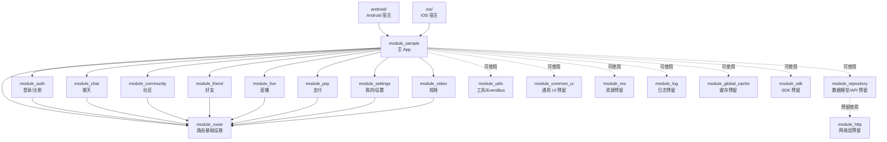
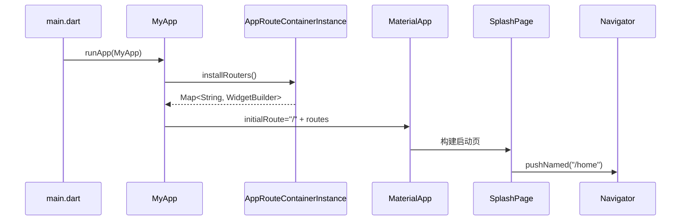

# 项目架构梳理

本文基于当前仓库代码整理，描述 `module_sample` 主工程与各本地 Flutter package/module 之间的职责、依赖和运行关系。

## 1. 总体定位

当前项目是一个 Flutter 主 App 加多模块本地 package 的样例工程。

- 主工程：`module_sample`，负责 App 启动、主题、首页/启动页和聚合所有业务路由。
- 业务模块：`module_auth`、`module_chat`、`module_community`、`module_friend`、`module_live`、`module_pay`、`module_settings`、`module_video`，每个模块维护自己的页面和路由注册 mixin。
- 基础能力模块：`module_route`、`module_repository`、`module_utils`、`module_http`、`module_common_ui`、`module_res`、`module_log`、`module_global_cache`、`module_sdk`，用于承载路由、数据模型、工具、网络、资源、日志、缓存、SDK 等公共能力。
- 平台宿主：`android/` 与 `ios/` 是主 App 的原生壳工程；各 `module_*` 目录下也保留了 Flutter package 生成的平台目录。

当前代码整体处于“模块化骨架”阶段：路由聚合机制已经成型，业务页面多为占位 `Scaffold`；网络、资源、日志、缓存等基础模块多数仍是空实现或模板类。

## 2. 目录结构

```text
.
├── lib/                              # 主 App Dart 代码（启动、壳页面、模块清单）
├── packages/
│   ├── commons/                      # 公共基础能力
│   │   ├── core/                     # module_core — 模型与服务契约
│   │   ├── ui/                       # module_common_ui — 共享 UI
│   │   ├── toolkit/                  # module_utils — 工具与播放器
│   │   ├── network/                  # module_http — HTTP 封装
│   │   └── storage/                  # module_global_cache — 缓存
│   ├── route/                        # module_route — 路由与模块注册
│   ├── features/                     # 业务模块（auth/chat/community/...）
│   └── infrastructure/               # 平台适配（linking/realtime/...）
├── android/                          # Android 宿主工程
├── ios/                              # iOS 宿主工程
└── docs/
    └── architecture.md               # 本文档
```

## 3. 模块关系总览



说明：

- 实线表示当前代码中已经存在的导入或运行时组合关系。
- 虚线表示模块职责上的预留关系，当前实现还不完整。
- 主 App 的 `pubspec.yaml` 将所有本地模块通过 `path` 引入，但目前放在 `dev_dependencies` 下；如果这些模块参与应用运行，通常应放在 `dependencies` 下。

## 4. 启动与页面注册流程

启动入口在 `lib/main.dart`：

1. `main()` 调用 `runApp(const MyApp())`。
2. `MyApp.build()` 通过 `AppRouteContainerInstance.share.installRouters()` 获取所有模块合并后的路由表。
3. `MaterialApp` 使用：
   - `initialRoute: RoutePath.splash`
   - `routes: installRouters`
4. 启动页 `SplashPage` 点击标题后调用 `RouteUtils.pushForNamed(context, RoutePath.home)` 进入首页。



## 5. 路由体系

路由能力由 `module_route` 提供。

### 5.1 路由常量

`module_route/lib/route/route_path.dart` 统一维护所有路由字符串：

| 路由 | 页面/模块 |
| --- | --- |
| `/` | 主 App `SplashPage` |
| `/home` | 主 App `HomePage` |
| `/login` | `module_auth` 登录页 |
| `/register` | `module_auth` 注册页 |
| `/chat` | `module_chat` 聊天页 |
| `/community` | `module_community` 社区页 |
| `/friend` | `module_friend` 好友页 |
| `/live` | `module_live` 直播页 |
| `/pay` | `module_pay` 支付页 |
| `/mine` | `module_settings` 我的页 |
| `/settings` | `module_settings` 设置页 |
| `/video` | `module_video` 视频页 |

### 5.2 路由容器

`MixinRouterContainer` 是路由组合基类：

- `installRouters()` 默认返回空 map。
- `openPage()` 对 `Navigator.pushNamed`、`pushReplacementNamed`、`popAndPushNamed`、`pushNamedAndRemoveUntil` 做统一封装。
- 入参会被包装为 `{'args': arguments}`，页面侧可通过 `getMixinArg(context)` 读取。

`MixinRouterInterceptContainer` 在 `MixinRouterContainer` 基础上增加路由拦截表：

- `registerRouteInterceptor(pageName, interceptor)` 注册拦截器。
- `openPage()` 时先判断是否需要拦截。
- 拦截器返回 `true` 表示拦截本次跳转，返回 `false` 表示继续执行原跳转。

`UriRouterInterceptContainer` 提供 URL 到页面的转换：

- 形如 `scheme://setting?arg=1` 的 URL 会被解析为 `"/setting"` 路由。
- query 参数会作为 arguments 传入，并额外附带 `_url` 原始地址。

`RouteUtils` 是另一组静态跳转工具：

- 支持直接 push Widget、按 name push、清栈跳转、替换、pop。
- 内置 `navigatorKey` 和根 `context` 预留，但当前 `MaterialApp` 中尚未设置 `navigatorKey: RouteUtils.navigatorKey`，因此全局 context 能力还没有真正接入。

### 5.3 路由组合机制

主 App 在 `lib/route/app_route_container_instance.dart` 中将各模块路由 mixin 混入同一个单例：

```dart
class AppRouteContainerInstance extends MixinRouterContainer
    with
        AppRouteContainer,
        AuthRouteContainer,
        ChatRouteContainer,
        CommunityRouteContainer,
        FriendRouteContainer,
        LiveRouteContainer,
        PayRouteContainer,
        SettingsRouteContainer,
        VideoRouteContainer {
  AppRouteContainerInstance._();

  static final AppRouteContainerInstance _instance = AppRouteContainerInstance._();

  static AppRouteContainerInstance get share => _instance;
}
```

每个模块的 `*RouteContainer` 都遵循同一模式：

1. 调用 `super.installRouters()` 获取其他 mixin 已注册的路由。
2. 创建当前模块自己的 `appRoutes`。
3. 将 `originRoutes` 合并进 `appRoutes`。
4. 返回合并结果。

由于 Dart mixin 的方法解析会按照混入顺序形成调用链，`installRouters()` 会从最后混入的模块开始向前调用 `super`，最终得到所有模块的路由表。

如果不同模块注册了相同路由 key，后续 `addAll(originRoutes)` 可能覆盖当前模块同名路由。当前项目没有发现重复路由。

## 6. 各模块职责

| 模块 | 当前职责 | 主要文件 |
| --- | --- | --- |
| `module_sample` | 主 App、启动页、首页、路由聚合 | `lib/main.dart`、`lib/pages/*`、`lib/route/*` |
| `module_auth` | 登录/注册页面与路由 | `user/login_page.dart`、`user/register_page.dart`、`route/auth_route_container.dart` |
| `module_chat` | 聊天页面与路由 | `chat/chat_page.dart`、`route/chat_route_container.dart` |
| `module_community` | 社区页面与路由 | `community/community_page.dart`、`route/community_route_container.dart` |
| `module_friend` | 好友页面与路由 | `friend/friend_page.dart`、`route/friend_route_container.dart` |
| `module_live` | 直播页面与路由 | `live/live_page.dart`、`route/live_route_container.dart` |
| `module_pay` | 支付页面与路由 | `pay/pay_page.dart`、`route/pay_route_container.dart` |
| `module_settings` | 我的/设置页面与路由 | `mine/mine_page.dart`、`settings/settings_page.dart`、`route/settings_route_container.dart` |
| `module_video` | 视频页面与路由 | `videos/video_page.dart`、`route/video_route_container.dart` |
| `module_route` | 路由常量、路由容器、拦截器、跳转工具 | `route/route_path.dart`、`container/*`、`route/route_utils.dart` |
| `module_repository` | WanAndroid 等业务数据模型，API 层预留 | `repository/model/*`、`repository/api.dart` |
| `module_http` | HTTP 封装和拦截器预留 | `http/http.dart`、`http/*_interceptor.dart` |
| `module_utils` | 工具类，当前实现 EventBus 工具 | `utils/event_bus_utils.dart` |
| `module_common_ui` | 通用 UI 组件预留 | `module_common_ui.dart` |
| `module_res` | 资源管理预留 | `module_res.dart` |
| `module_log` | 日志能力预留 | `module_log.dart` |
| `module_global_cache` | 全局缓存预留 | `module_global_cache.dart` |
| `module_sdk` | 第三方/业务 SDK 封装预留 | `module_sdk.dart` |

## 7. 数据与工具层

### 7.1 `module_repository`

当前主要包含接口数据模型：

- 首页：`HomeBannerModel`、`HomeListModel`、`HomeTopListModel`
- 知识体系：`KnowledgeListModel`、`KnowledgeDetailListModel`、`KnowledgeDetailParam`
- 搜索：`SearchHotKeyListModel`、`SearchListModel`
- 用户：`UserInfoModel`
- 收藏：`MyCollectsModel`
- 常用网站：`CommonWebsiteModel`
- App 更新：`AppCheckUpdateModel`

`repository/api.dart` 当前为空，说明 API 常量、Repository 方法或数据源封装尚未落地。

### 7.2 `module_http`

`module_http/lib/http/` 下预留了：

- `http.dart`
- `my_interceptor.dart`
- `rsp_interceptor.dart`
- `log_print_interceptor.dart`

这些文件当前为空，表示网络请求封装、响应拦截、日志拦截尚未实现。

### 7.3 `module_utils`

当前有实际实现的是 `EventBusUtils`：

- 基于 `rx_event_bus`。
- 支持普通事件和粘性事件。
- 提供 `EventBean`、`CustomEvent` 和 `EventBusType` 示例枚举。
- `event_bus_test.dart` 给出发送和订阅示例。

注意：`rx_event_bus` 当前写在 `module_utils/pubspec.yaml` 的 `dev_dependencies` 中，但 `lib/utils/event_bus_utils.dart` 是运行时代码。如果该模块作为依赖被其他模块使用，`rx_event_bus` 应放在 `dependencies` 下。

其他工具文件如 `date_utils.dart`、`file_utils.dart`、`permission_utils.dart`、`sp_utils.dart`、`string_utils.dart` 当前为空。

## 8. 平台工程关系

主平台宿主：

- Android：`android/`
  - `android/settings.gradle` 引入 Flutter Gradle 插件。
  - `android/app/build.gradle` 使用 `dev.flutter.flutter-gradle-plugin`，并设置 `flutter { source '../..' }` 指向仓库根目录的 Flutter 工程。
  - `MainActivity.kt` 是默认 Flutter Activity。
- iOS：`ios/`
  - `ios/Runner/AppDelegate.swift` 注册 Flutter 插件并启动 Flutter App。

各 `module_*` 目录下也存在 `android/`、`ios/`、`linux/`、`macos/`、`windows/` 等目录，这些是 Flutter package 创建时生成的平台支撑文件。当前主运行路径仍是根工程的 `android/` 和 `ios/`。

## 9. 添加新业务模块的方式

以新增 `module_xxx` 为例，建议流程如下：

1. 创建本地 Flutter package，并在其中实现页面。
2. 在 `module_route/lib/route/route_path.dart` 增加路由常量，例如 `static const String xxx = '/xxx';`。
3. 在 `module_xxx/lib/route/xxx_route_container.dart` 中实现 `mixin XxxRouteContainer on MixinRouterContainer`。
4. 在 `installRouters()` 中注册当前模块页面。
5. 在主工程 `pubspec.yaml` 引入 `module_xxx`。
6. 在 `lib/route/app_route_container_instance.dart` 导入并混入 `XxxRouteContainer`。

如果模块需要跳转其他页面，优先依赖 `module_route` 中的 `RoutePath` 和 `RouteUtils`/`MixinRouterContainer`，避免在业务模块中散落字符串路由。

## 10. 当前注意点

- 主工程和多个模块把运行时本地模块写在 `dev_dependencies` 中。当前能否运行取决于 Flutter/Pub 解析结果，但从语义上看，参与 `lib/` 运行时代码 import 的 package 应放在 `dependencies`。
- `module_utils` 的 `rx_event_bus` 也位于 `dev_dependencies`，但被 `lib/` 代码直接 import，建议调整到 `dependencies`。
- `RouteUtils.navigatorKey` 当前没有挂到 `MaterialApp`，所以 `RouteUtils.context`/`RouteUtils.navigator` 的全局导航能力暂不可用。
- `module_http`、`module_repository/api.dart`、多个工具/基础模块仍为空实现，后续需要明确网络层、数据源和错误处理边界。
- 多个页面标题仍为模板文案，例如部分模块页面显示 `"RegisterPage"`，与模块语义不一致。
- 多数 `module_*.dart` 仍是 Flutter package 默认 `Calculator` 示例，后续可以改成模块统一 export 文件。

## 11. 建议的演进方向

- 将模块依赖从 `dev_dependencies` 调整到 `dependencies`，让依赖语义和运行时 import 一致。
- 用 `module_route` 作为唯一跨模块导航协议层，保持业务模块之间不直接互相依赖。
- 为每个模块的 `module_xxx.dart` 建立明确导出，例如导出路由容器、公共页面或公共服务。
- 完善 `module_http` 与 `module_repository` 的分层：HTTP 负责请求基础设施，Repository 负责 API 语义和模型转换。
- 将公共组件、主题、颜色、字体、图片资源逐步沉淀到 `module_common_ui` 与 `module_res`。
- 为路由聚合添加测试，至少校验所有 `RoutePath` 都能注册到最终路由表，防止新增模块时漏接。
