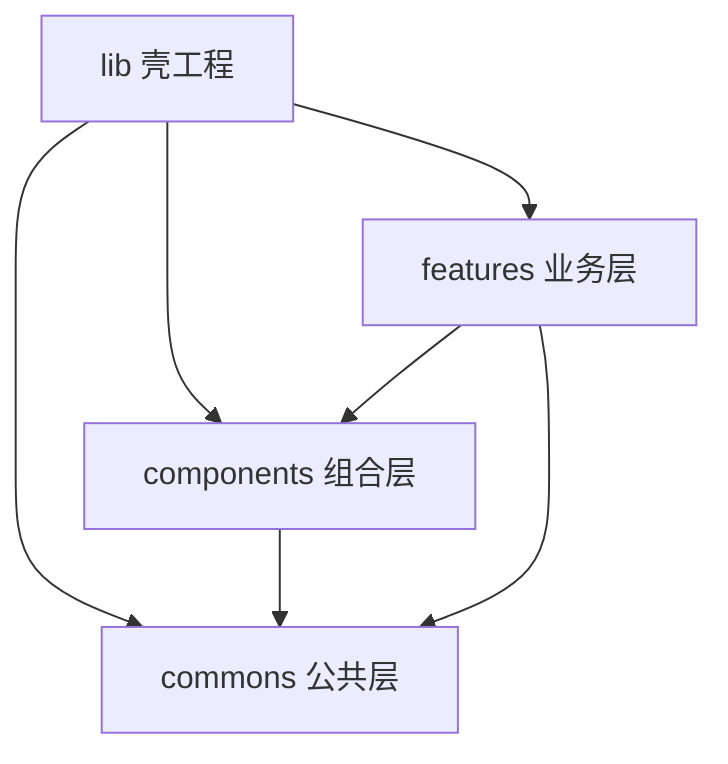
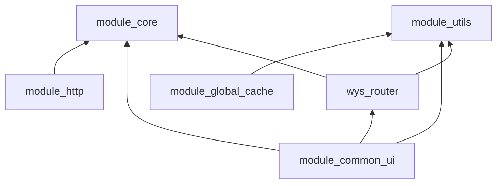
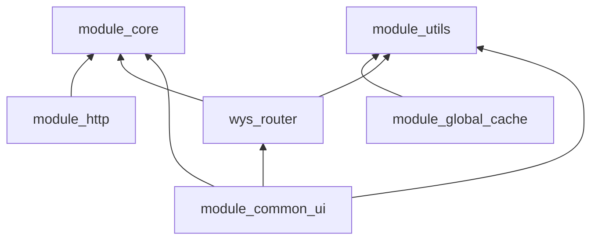
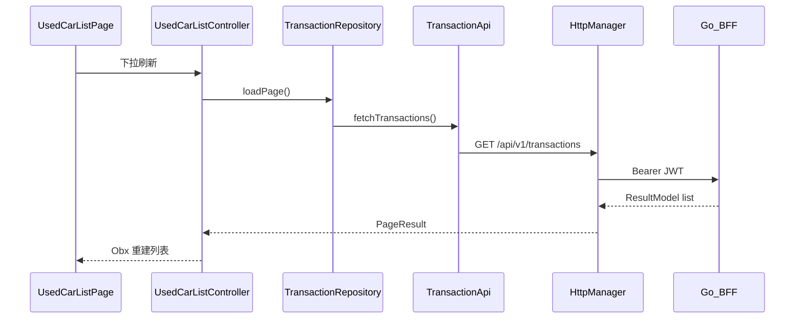

# 项目架构（lib / commons / components / features）

本文基于当前仓库代码整理，描述 `module_sample` 主工程与本地 Flutter package 之间的职责、依赖和运行关系。

> **开发规范与常见陷阱**：[AGENTS.md](../AGENTS.md)  
> **模块化开发指南**：[MODULE_ARCHITECTURE.md](./MODULE_ARCHITECTURE.md)  
> **后端交互说明**：[BACKEND_INTEGRATION.md](./BACKEND_INTEGRATION.md)

---

## 1. 总体定位

本项目是 **Flutter 模块化 Monolith**，代码组织为 **四个同级目录层**：

| 层级 | 路径 | 职责 |
|------|------|------|
| **lib** | `lib/` | 壳工程：启动、全局 DI、模块清单、Tab 容器、壳级路由 |
| **commons** | `commons/` | 必选基础：模型契约、HTTP、UI、工具、存储、路由/模块注册 |
| **components** | `components/` | 可选组合：Realtime、深链、IM、蓝牙、DoKit；部分 feature 才引入 |
| **features** | `features/` | 业务模块：各功能域的页面、ViewModel、Repository、Api |

依赖方向：`lib → features/components/commons`，`features → components/commons`，`components → commons`。  
**禁止** `commons → components/features`，**禁止** `components → features`。

后端交互：**Flutter → Go BFF (`my_go_study`) → Supabase**（业务层不直连 Supabase SDK）。

### 1.1 架构总览



**各层内容**：

| 层 | 包含 |
|----|------|
| lib | `AppInitializer`、`module_manifest`、`Splash/Main`、路由合并 |
| commons | `module_core`、`module_http`、`module_common_ui`、`module_utils`、`module_global_cache`、`wys_router` |
| components | `module_realtime`、`module_linking`、`module_rongcloud_im`、`module_bluetooth`、`dokit*` |
| features | `module_home`、`module_auth`、`module_chat` 等 12 个业务包 |

**commons 内部依赖**：



### 1.2 仓库目录

```text
.
├── lib/                              # 壳工程层
├── commons/                          # 公共能力层
│   ├── core/                         # module_core
│   ├── network/                      # module_http
│   ├── storage/                      # module_global_cache
│   ├── toolkit/                      # module_utils
│   ├── ui/                           # module_common_ui
│   └── wys_router/                   # wys_router（RoutePath + FeatureModule + URL 桥）
├── features/                         # 业务模块层（12 个 module_*）
│   ├── home/
│   ├── auth/
│   ├── chat/
│   └── ...
├── components/                       # 可选组合层
│   ├── realtime/
│   ├── linking/
│   ├── rongcloud_im/
│   ├── bluetooth/
│   ├── dokit/
│   └── dokit_bootstrap/
├── android/
├── ios/
└── docs/
```

---

## 2. lib — 壳工程（集成层）

**职责**：启动、全局 DI、模块清单、Tab 容器、壳级路由、国际化。**不含业务逻辑**（约 17 个 Dart 文件）。

### 2.1 目录结构

```text
lib/
├── main.dart                         # AppInitializer + main 入口
├── bootstrap/
│   ├── app_runner_debug.dart         # Debug：DoKit 包装启动
│   ├── app_runner_release.dart       # Release：直接 runApp
│   ├── dokit_navigator_observers_debug.dart
│   └── dokit_navigator_observers_stub.dart
├── app/
│   ├── app.dart                      # GetMaterialApp 根 Widget
│   ├── app_pages.dart                # 壳路由 + 模块路由合并
│   ├── app_binding.dart              # AppController DI
│   └── app_controller.dart           # 主题、语言、沉浸式
├── config/
│   └── module_manifest.dart          # 模块启用清单（可插拔）
├── route/
│   └── app_route_container.dart      # 壳路由：Splash / Main / WebKit
├── pages/
│   ├── splash_page.dart              # 启动页 → 隐私 → Main
│   └── main_page.dart                # 底部 Tab 宿主（IndexedStack）
└── l10n/                             # 壳级国际化
```

### 2.2 关键文件职责

| 文件 | 职责 |
|------|------|
| `lib/main.dart` | `AppInitializer.init()`：工具/DB/HTTP/Auth/UiKit/WebKit → `ModuleRegistry` → Linking/IM/Realtime |
| `lib/config/module_manifest.dart` | **模块开关**：注释 import + `buildEnabledModules()` 即可裁剪模块 |
| `lib/app/app_pages.dart` | 合并壳路由与 `ModuleRegistry.collectRoutes()` 为 `GetPage` 列表 |
| `lib/pages/main_page.dart` | 从 `ModuleRegistry.collectMainTabs()` 动态构建 Tab |
| `lib/route/app_route_container.dart` | 壳路由：`/` Splash、`/main` Tab 宿主、WebKit 路由 |

### 2.3 启动流程

```text
main
  → AppRunner.launch()                    # Debug: DoKit | Release: 直接启动
  → AppInitializer.init()
      → ModuleUtilsInitializer            # 日志、ScreenUtil 等
      → SpManager / AppDatabase
      → EnvironmentSession.register()     # 多环境配置
      → AppHttpBootstrap.initialize()     # Go BFF HTTP（Auth 拦截器）
      → AuthSession.register()
      → UiKitInitializer / WebKitInitializer
      → ModuleRegistry.registerAll(buildEnabledModules())
      → ModuleRegistry.bootstrap()        # 各模块 onRegister
      → AppBinding + LinkingBinding + 各模块 Binding
      → LinkingInitializer / ImInitializer / RealtimeInitializer (deferred)
  → runApp(App())
      → initialRoute: /
      → getPages: AppPages.routes()
```

### 2.4 路由与 Tab

**路由合并**（`lib/app/app_pages.dart`）：

1. `AppRouteContainer().installShellRouters()` — 壳路由
2. `ModuleRegistry.collectRoutes()` — 各 `FeatureModule.routes()`
3. 合并后转为 `GetPage` 列表

**路径常量**统一在 `commons/wys_router/lib/src/route/route_path.dart`。

**Tab 构建**：`MainPage` 调用 `ModuleRegistry.collectMainTabs()`，按 `order` 排序。当前 4 个 Tab：

| order | 模块 | 路由 | 页面 |
|-------|------|------|------|
| 0 | home | `/home` | 首页 |
| 1 | chat | `/chat` | 聊天 |
| 2 | community | `/community` | 社区 |
| 3 | settings | `/mine` | 我的 |

**当前已启用模块**（`lib/config/module_manifest.dart`，共 12 个）：

Home、Classroom、Chat、Community、Settings、Auth、Friend、Live、Pay、Video、Bfui、Music

---

## 3. commons — 公共能力层

位于 `commons/`，共 **6 个子包**。**目录名 ≠ pubspec 名**，import 以 pubspec 为准。

### 3.1 包一览

| 目录 | Pubspec 名 | Import | 层级 | 职责 |
|------|------------|--------|------|------|
| `core/` | `module_core` | `package:module_core/core.dart` | L0 基础 | 领域模型、服务**契约**（Auth/User/IM/Realtime）、Env 配置、WebView Bridge 类型；无 UI/HTTP |
| `toolkit/` | `module_utils` | `package:module_utils/module_utils.dart` | L0 基础 | 日志、权限、图片/扫码、短视频播放器、EventBus、`ModuleUtilsInitializer` |
| `network/` | `module_http` | `package:module_http/module_http.dart` | L1 基础设施 | Dio `HttpManager`、`AppHttpBootstrap`、`ResultModel<T>` 信封、Go BFF 解析与拦截器 |
| `storage/` | `module_global_cache` | `package:module_global_cache/module_global_cache.dart` | L1 基础设施 | `SpManager` + sqflite `AppDatabase` |
| `wys_router/` | `wys_router` | `package:wys_router/wys_router.dart` | L1 基础设施 | 路由常量、`FeatureModule`、`ModuleRegistry`、URL/原生桥、独立运行 runner |
| `ui/` | `module_common_ui` | `package:module_common_ui/module_common_ui.dart` | L2 表现层 | 主题、Dialog、Layout（含沉浸式视频 Scope）、Refresh/Loading、`BaseViewModel`、`UiKitInitializer` |

### 3.2 内部依赖



**分层约定**：

- L0（core、utils）不依赖其他 commons 包
- L1（http、storage、route）依赖 L0
- L2（ui）依赖 L0 + route

### 3.3 各包详细职责

#### module_core（`commons/core/`）

| 区域 | 内容 |
|------|------|
| Env | `AppEnv`、`EnvConfig`、`AppAuthConfig` |
| Auth | `AuthService` 契约、`AuthFailure`、`AuthSessionState`、`PhoneAuthUtils` |
| User | `User` 模型、`UserService` 契约 |
| IM | `ImSessionService`、`ImUserProfileService`、会话/Profile 模型 |
| Realtime | `AppRealtimeClient` 契约、`RealtimeEnvelope`、连接状态 |
| Web Bridge | `WebBridgeRegistry`、actions、constants、`WebPageConfig` |
| Dev | `MockAuthService`、`MockUserService`、`DefaultEnvironmentService` |

#### module_http（`commons/network/`）

| 导出 | 用途 |
|------|------|
| `HttpManager` / `HttpResult` | Dio 封装（GET/POST/PUT/PATCH/DELETE/upload） |
| `AppHttpBootstrap` | 初始化 HTTP：base URL、env header、auth headers |
| `ResultModel<T>` | 标准 API 信封（`code`、`message`、`data`、pagination） |
| `BackendResponseParser` | 解析 Go BFF 响应格式 |
| `AuthHeaderProvider` | 注入 Bearer token |
| Interceptors | env header、retry、logging、response hooks |

#### module_global_cache（`commons/storage/`）

| 导出 | 用途 |
|------|------|
| `AppDatabase` | sqflite 单例 |
| `SpManager` / `SpKeys` | SharedPreferences 封装 |
| `AppSettings` | JSON 可序列化设置模型 |

#### module_utils（`commons/toolkit/`）

| 区域 | 内容 |
|------|------|
| Init | `ModuleUtilsInitializer`、`ModuleUtilsConfig` |
| Utils | `LogUtils`、`SpUtils`、`ScreenUtilUtils`、`ImagePickerUtils`、`ScanUtils` 等 |
| Player | 短视频播放器 kit、`AppVideoControlsBar` |
| EventBus | `EventBusUtils` |

#### module_common_ui（`commons/ui/`）

| 区域 | 内容 |
|------|------|
| Init | `UiKitInitializer` — BotToast + `AppLoading` 注册 |
| Base | `BaseViewModel`（GetX） |
| Dialog | `AppDialogManager`、confirm/general、媒体选择 |
| Layout | `AppPageScaffold`、`AppNavBar`、`AppSafeInsets`、`VideoPlaybackImmersiveScope` |
| Kit | `AppRefreshView`、WebView pages + navigator |
| Theme | `AppTheme`、`AppScreenUtil`、`IosTabBar` |

### 3.4 关键文件索引

| 文件 | 说明 |
|------|------|
| `commons/network/lib/http/app_http_bootstrap.dart` | HTTP 初始化 |
| `commons/network/lib/api/result_model.dart` | API 信封 |
| `commons/ui/lib/base/base_viewmodel.dart` | ViewModel 基类 |
| `commons/ui/lib/layout/video_playback_immersive_scope.dart` | 视频沉浸式 Scope |

### 3.5 网络分层约定

Feature 模块内自包含请求逻辑，标准数据流：

```text
View → ViewModel → Repository → Api → HttpManager → Go BFF
```

`ResultModel<T>` 仅在 Api/Repository 层解包，UI 层不直接依赖。

---

## 4. features — 业务模块层

位于 `features/`，每个模块实现 `FeatureModule` 契约（`commons/wys_router/lib/src/module/feature_module.dart`）：

```dart
abstract class FeatureModule {
  String get moduleId;
  Map<String, WidgetBuilder> routes();
  ModuleTabItem? get mainTab => null;   // Tab 模块才实现
  Bindings? createBinding() => null;
  Future<void> onRegister(ModuleHostContext context) async {}
}
```

### 4.1 标准内部分层

以 `module_home` 为模板（详见 [MODULE_ARCHITECTURE.md](./MODULE_ARCHITECTURE.md)）：

```text
module_xxx/
├── pubspec.yaml
├── lib/
│   ├── xxx_module.dart              # FeatureModule 唯一注册点
│   ├── main_dev.dart                # 可选：独立运行
│   ├── module_xxx.dart              # 对外 export
│   └── xxx/
│       ├── view/                    # UI（GetView / Page）
│       ├── viewmodel/ 或 controller/
│       ├── repository/
│       ├── api/
│       └── model/
```

| 层级 | 命名 | 职责 |
|------|------|------|
| View | `*_page.dart` | UI 渲染、事件转发 |
| ViewModel | `*_viewmodel.dart` / `*_controller.dart` | 状态管理、调用 Repository |
| Repository | `*_repository.dart` | 封装数据来源（网络/本地） |
| Api | `*_api.dart` | HTTP 请求、协议与路径 |
| Model | `*_model.dart` | 数据结构、JSON 解析 |

### 4.2 模块一览

| moduleId | package | Tab | 主要职责 | 成熟度 |
|----------|---------|-----|----------|--------|
| home | `module_home` | 首页 (0) | 仪表盘、全部服务、搜索、配音、二手车(Go BFF)、WebBridge | 高 |
| chat | `module_chat` | 聊天 (1) | IM 会话列表/详情，依赖 RongCloud | 高 |
| community | `module_community` | 社区 (2) | 动态流、发布、评论（Mock） | 中 |
| settings | `module_settings` | 我的 (3) | 个人中心、设置、开发调试入口 | 高 |
| auth | `module_auth` | — | 登录/注册、Go BFF Auth、`AuthSession` | 高 |
| video | `module_video` | — | 短视频、配音视频/作品、沉浸式播放 | 中 |
| classroom | `module_classroom` | — | 课堂/作业/礼品卡 POC | 中 |
| music | `module_music` | — | 本地音乐播放、迷你播放器（Home 嵌入） | 中 |
| live | `module_live` | — | 直播入口/房间（Mock + Realtime） | 低 |
| pay | `module_pay` | — | 支付/会员续费 UI | 低 |
| friend | `module_friend` | — | 好友占位 | 低 |
| bfui | `module_bfui` | — | Flutter UI 模板 Demo 画廊 | Demo |

### 4.3 跨模块依赖（允许的最小集）

Feature 模块 **禁止** 互相 import 页面/ViewModel。当前允许的跨模块依赖：

| 模块 | 依赖 |
|------|------|
| home | auth、music |
| settings | auth + components（linking、realtime、im、bluetooth） |
| chat | module_rongcloud_im |
| live | module_realtime |

其余模块仅依赖 commons + route。

跨模块通信方式：

- 路由跳转（`Get.toNamed(RoutePath.xxx)`）
- `module_core` 抽象服务 + GetX 注册
- EventBus（`module_utils`，按需）

### 4.4 数据流示例（二手车）



参考：`features/home/lib/home/api/transaction_api.dart`

### 4.5 模块独立运行

已实现 `main_dev.dart` 的模块可单独调试：

```bash
flutter run -t features/home/lib/main_dev.dart
```

独立运行时 `ModuleStandaloneRunner.run(XxxModule())` 启动最小 GetMaterialApp，模块自行初始化 HTTP。

---

## 5. 附录：route 与 components

### 5.1 wys_router（`commons/wys_router/`）

| 组件 | 职责 |
|------|------|
| `RoutePath` | 全项目路由常量 |
| `FeatureModule` | 模块契约 |
| `ModuleRegistry` | 注册、bootstrap、collectRoutes/collectMainTabs/collectBindings |
| `ModuleHostContext` | 集成/独立运行上下文 |
| `ModuleStandaloneRunner` | 模块独立运行入口 |

### 5.2 components（`components/`）

| 包 | 职责 |
|----|------|
| `module_realtime` | WebSocket 客户端、Go BFF Realtime、心跳/重连 |
| `module_linking` | 深链 + 推送（JPush）、隐私 consent |
| `module_rongcloud_im` | RongCloud IM 引擎、会话 API |
| `module_bluetooth` | BLE demo/components |
| `module_dokit` | Vendored DoKit 调试工具 |
| `module_dokit_bootstrap` | Debug 构建 DoKit 注册 |

根 `pubspec.yaml` 当前引入：linking、realtime/rongcloud_im、dokit_bootstrap（bluetooth 经 settings 模块间接使用）。

---

## 6. 根 pubspec 依赖映射

根 `pubspec.yaml` 通过 `path` 引入所有本地包：

| 类别 | 包 |
|------|-----|
| Commons | `module_core`、`module_http`、`module_common_ui`、`module_global_cache`、`module_utils`、`wys_router` |
| Features | `module_auth`、`module_home`、`module_chat`、`module_community`、`module_settings`、`module_classroom`、`module_friend`、`module_live`、`module_pay`、`module_video`、`module_bfui`、`module_music` |
| Components | `module_linking`、`module_realtime`、`module_rongcloud_im`、`module_dokit_bootstrap` |

---

## 7. 相关文档

| 文档 | 内容 |
|------|------|
| [AGENTS.md](../AGENTS.md) | HTTP/Auth/Realtime/GetX Obx 等开发规范与常见陷阱 |
| [MODULE_ARCHITECTURE.md](./MODULE_ARCHITECTURE.md) | 模块化开发指南、MVVM 分层、新建模块 checklist |
| [BACKEND_INTEGRATION.md](./BACKEND_INTEGRATION.md) | Flutter ↔ Go BFF ↔ Supabase 完整交互说明 |
