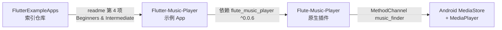

# FlutterExampleApps 音乐播放器示例迁移分析

本文档分析 [FlutterExampleApps](https://github.com/iampawan/FlutterExampleApps) 索引中的 **Music Player App**（本地音乐播放示例），对应你提供的 **Now Playing** 截图，为后续迁入当前项目做准备。

> **说明**：`FlutterExampleApps` 本身**不是**可运行 App，而是示例链接合集；截图对应的完整源码在独立仓库 [Flutter-Music-Player](https://github.com/iampawan/Flutter-Music-Player)，底层音频能力由插件 [Flute-Music-Player](https://github.com/iampawan/Flute-Music-Player) 提供。

---

## 1. 仓库关系



| 仓库 | 作用 | Pin Commit (master) |
|------|------|---------------------|
| [FlutterExampleApps](https://github.com/iampawan/FlutterExampleApps) | 示例链接 + YouTube 教程索引 | — |
| [Flutter-Music-Player](https://github.com/iampawan/Flutter-Music-Player) | 完整 UI 示例 App | `73c220cddb1f9dc316cc7e7b7d83fb48d7ed33b8` |
| [Flute-Music-Player](https://github.com/iampawan/Flute-Music-Player) | 扫描本地歌曲 + 播放控制 | `375653ba14bc7bb20c137c8b422c4c1dfdce7400` |

**教程视频**：[Flutter Music Player App](https://www.youtube.com/watch?v=eWicXD5vkyg)（readme 链接）

**许可证**：Apache 2.0（App 与 Plugin 均为 Pawan Kumar 开源）

---

## 2. 功能清单

### 2.1 已实现（上游 README）

| 功能 | 说明 |
|------|------|
| 扫描本地歌曲 | `MusicFinder.allSongs()`，内置 Android 存储权限申请 |
| 播放 / 暂停 / 停止 | `play` / `pause` / `stop` |
| 进度 seek | Slider + `seek(seconds)` |
| 上一首 / 下一首 | `SongData.prevSong` / `nextSong` |
| 随机播放 | FAB shuffle → `randomSong` |
| 专辑封面 | 从 MediaStore 读取 `albumArt` URI |
| 静音 | `mute(bool)` |
| 播放完成回调 | `onComplete` 自动下一首 |
| 时长 / 当前位置 | `onDuration` / `onCurrentPosition` 流式回调 |

### 2.2 未实现 / 已废弃

| 项 | 状态 |
|----|------|
| iOS | README 明确 **未实现** |
| 鸿蒙 OHOS | 无适配 |
| 在线电台 | README 标注 Coming Soon |
| 多主题 | 代码有 `themes.dart` 枚举，但未接入 UI 切换 |
| `flute_music_player` pub 包 | **已 discontinued**，最后版本 0.0.6（2018 前后） |

---

## 3. 源码结构（Flutter-Music-Player）

```
lib/
  main.dart                 # runApp(MyApp)
  my_app.dart               # 启动时拉取歌曲列表，包 MPInheritedWidget
  data/
    song_data.dart          # 播放列表、索引、MusicFinder 单例
  pages/
    root_page.dart          # 歌曲列表主页 + FAB 随机播放
    now_playing.dart        # ★ Now Playing 页（截图对应）
  widgets/
    mp_album_ui.dart        # 封面 Hero + 弹性缩放动画 + 底部进度条
    mp_blur_widget.dart     # 全屏模糊背景（专辑图）
    mp_blur_filter.dart     # BackdropFilter 高斯模糊
    mp_control_button.dart  # 播放控制 IconButton
    mp_lisview.dart         # 歌曲 ListView
    mp_inherited.dart       # InheritedWidget 传递 SongData
    mp_circle_avatar.dart   # 列表项圆形封面
    mp_drawer.dart          # 侧栏（root_page 中已注释）
  utils/
    themes.dart             # dark/light ThemeData
    file_image.dart
assets/
  lady.jpeg                 # 无封面时的默认背景
  music_record.jpeg         # 无封面时的默认专辑图
```

**包名**：`flute_example`（pubspec），import 前缀 `package:flute_example/...`

**Dart 文件数**：14 个（不含 platform）

---

## 4. 页面与 UI 拆解（对应截图）

### 4.1 页面导航流

```
MyApp (加载歌曲)
  └─ RootPage（歌曲列表）
       ├─ ListTile.onTap → NowPlaying(songData, song)
       ├─ AppBar「Now Playing」→ NowPlaying(nowPlayTap: true)
       └─ FAB shuffle → NowPlaying(randomSong)
```

### 4.2 Now Playing 布局（`now_playing.dart`）

```
Scaffold
├─ AppBar: "Now Playing"（居中）
└─ body: Stack (fit: expand)
    ├─ [底层] blurWidget(song)     — 专辑图全屏 + darken
    ├─ [中层] blurFilter()         — BackdropFilter blur σ=10
    └─ [顶层] Column
         ├─ AlbumUI                — 250×250 封面 Hero + 弹性入场动画
         └─ Material(transparent)
              └─ 控制区 Column
                   ├─ 标题 song.title (headline)
                   ├─ 艺术家 song.artist (caption)
                   ├─ Row: ⏮ pause/play ⏭
                   ├─ Slider (position / duration)
                   ├─ 时间文本 "position / duration"
                   └─ IconButton 静音 (headset / headset_off)
```

### 4.3 截图与代码对照

| 截图元素 | 代码位置 | 实现要点 |
|----------|----------|----------|
| 黑色顶栏 + 返回 + "Now Playing" | `Scaffold.appBar` | 系统 AppBar，非自定义 |
| 模糊背景 | `mp_blur_widget.dart` + `mp_blur_filter.dart` | `Image.file(albumArt)` + `BackdropFilter` |
| 居中方形封面 | `mp_album_ui.dart` | `Hero` + `AnimationController` 弹性缩放 |
| 歌曲名 / 歌手 | `now_playing.dart` `_buildPlayer` | `song.title` / `song.artist` |
| ⏮ ⏸ ⏭ | `ControlButton` | `Icons.skip_previous/pause/skip_next` |
| 进度条 | `Slider` | `audioPlayer.seek()` |
| 时间 0:00:05 / 0:04:55 | `positionText / durationText` | `Duration.toString()` 截断毫秒 |
| Mute 按钮 | `IconButton` + `mute()` | `headset_off` 表示可静音 |

### 4.4 视觉特效

1. **Hero 转场**：列表 `Hero(tag: song.title)` ↔ 播放页 `Hero(tag: song.title)`；背景 `Hero(tag: song.artist)`。
2. **封面入场**：`Curves.elasticOut` 1 秒缩放动画（`AlbumUI`）。
3. **封面底部迷你进度**：`AlbumUI` 内双层 `LinearProgressIndicator`。
4. **背景模糊**：`ImageFilter.blur(sigmaX/Y: 10)` + 半透明黑遮罩。

---

## 5. 数据与播放逻辑

### 5.1 Song 模型（来自 `flute_music_player`）

```dart
class Song {
  int id;
  String artist, title, album;
  int albumId, duration, trackId;
  String uri;       // 本地文件 URI，play 时使用
  String albumArt;  // 封面 URI
}
```

由 Android 原生 `getSongs` 经 MethodChannel 返回 `Map` 后 `Song.fromMap` 解析。

### 5.2 SongData（播放队列）

| 成员 | 作用 |
|------|------|
| `songs` | 全部本地歌曲 |
| `currentIndex` | 当前播放索引 |
| `nextSong` / `prevSong` | 索引 ±1 后返回 Song |
| `randomSong` | `Random` 随机一首 |
| `audioPlayer` | `MusicFinder` 实例 |

### 5.3 状态管理（上游）

- **无** BLoC / Provider / GetX
- 使用 `InheritedWidget`（`MPInheritedWidget`）向下传递 `SongData` + `isLoading`
- `NowPlaying` 内部 `StatefulWidget` + `setState` 管理 `PlayerState`（stopped/playing/paused）

### 5.4 MusicFinder API（插件）

| Dart 方法 | Native Channel | 回调 |
|-----------|----------------|------|
| `MusicFinder.allSongs()` | `getSongs` | — |
| `play(url, isLocal: true)` | `play` | `audio.onStart` |
| `pause()` | `pause` | — |
| `stop()` | `stop` | — |
| `seek(seconds)` | `seek` | — |
| `mute(muted)` | `mute` | — |
| `setDurationHandler` | ← `audio.onDuration` | ms → Duration |
| `setPositionHandler` | ← `audio.onCurrentPosition` | ms → Duration |
| `setCompletionHandler` | ← `audio.onComplete` | 播放结束 |
| `setErrorHandler` | ← `audio.onError` | 错误消息 |

插件 Android 包名：`com.mtechviral.musicfinder.MusicFinderPlugin`

---

## 6. 依赖与版本

### 6.1 App（Flutter-Music-Player）

```yaml
dependencies:
  cupertino_icons: ^0.1.0
  flute_music_player: ^0.0.6   # 已 discontinued
environment:
  sdk: 未显式约束（极老项目）
```

### 6.2 插件（Flute-Music-Player）

```yaml
environment:
  sdk: ">=2.0.0-dev.28.0 <3.0.0"   # 不支持 Dart 3
flutter:
  plugin:
    androidPackage: com.mtechviral.musicfinder
    pluginClass: MusicFinderPlugin
    # 无 ios / ohos 实现
```

### 6.3 与现代 Flutter 的冲突

| 问题 | 影响 |
|------|------|
| Dart 2 / 旧 API | `inheritFromWidgetOfExactType`、`ThemeData.backgroundColor/buttonColor/caption` 等已废弃 |
| 无 null safety | 需全面迁移 |
| `flute_music_player` 停更 | 不能直接用于 Flutter 3.35 + OHOS |
| 仅 Android MethodChannel | iOS / OHOS / Web 不可用 |

---

## 7. 与当前项目的差异

| 维度 | 上游 Music Player | 当前项目 |
|------|-------------------|----------|
| 架构 | 单 App + InheritedWidget | 多模块 `FeatureModule` + GetX |
| 路由 | `Navigator.push` / `MaterialPageRoute` | `RoutePath` + `Get.toNamed` |
| 状态 | `setState` | GetX Controller + Obx |
| UI 基建 | 原生 Material | `module_common_ui`（AppNavBar、AppPageScaffold） |
| 鸿蒙 | 无 | 必须 CPF-Flutter 适配（见 AGENTS.md） |
| 音频 | 自研 Android 插件 | **尚无** audio/music 模块 |

---

## 8. 迁移策略建议

### 8.1 总体原则

1. **UI 可迁移，插件不可直接复用**：Now Playing 的 Stack 模糊背景、封面动画、控制条可直接移植；`flute_music_player` 必须替换。
2. **音频层选型**（须支持 Android / iOS / OHOS）：

| 方案 | 优点 | 鸿蒙 |
|------|------|------|
| [just_audio](https://pub.dev/packages/just_audio) + [audio_service](https://pub.dev/packages/audio_service) | 社区活跃、功能完整 | 查 CPF-Flutter 是否有 `_ohos` 分支 |
| [audioplayers](https://pub.dev/packages/audioplayers) | API 简单 | 同上 |
| 仅 UI 迁移 + Mock 数据 | 快速 POC、无权限 | 纯 Dart，可先跑通界面 |

3. **本地歌曲扫描**：上游依赖 Android MediaStore；迁移时需分别实现或使用 `on_audio_query` / `media_scanner` 等（均需查 OHOS 适配）。

### 8.2 推荐模块落位

```
packages/features/music/
  lib/
    music_module.dart
    module_music.dart
    model/local_song.dart          # 对齐 Song 字段
    service/audio_player_service.dart
    service/local_music_repository.dart
    controller/
      music_list_controller.dart
      now_playing_controller.dart
    view/
      music_list_page.dart         # 对应 RootPage
      now_playing_page.dart        # 对应 NowPlaying
    widgets/
      music_album_art.dart         # 来自 mp_album_ui
      music_blur_background.dart   # blur_widget + blur_filter
      music_control_bar.dart       # control + slider
  assets/
    defaults/                      # lady.jpeg / music_record.jpeg
```

路由建议：

```
/music/list              # 歌曲列表
/music/now_playing       # 播放页（arguments 传 songId）
```

### 8.3 代码改造清单

| 上游文件 | 迁移动作 |
|----------|----------|
| `my_app.dart` 初始化 | → `MusicListController.onInit` + Repository |
| `MPInheritedWidget` | → GetX `Get.put` / `GetView` |
| `now_playing.dart` | → `NowPlayingController` + `Obx` 读 position/duration/playerState |
| `Navigator.push` | → `Get.toNamed(RoutePath.musicNowPlaying, arguments: ...)` |
| `MusicFinder` | → `AudioPlayerService` 抽象接口 + 平台实现 |
| `File(albumArt)` | → 保留；OHOS 需验证 URI 格式 |
| `themes.dart` | → 接入 `module_common_ui` 主题或保留 dark 主题 |

### 8.4 GetX / Obx 注意点

播放进度高频更新，避免整页 `Obx`：

```dart
// ✅ 仅进度条区域订阅 position
Obx(() {
  final pos = controller.position.value;
  final dur = controller.duration.value;
  return MusicProgressSlider(position: pos, duration: dur);
});
```

### 8.5 权限（Android / OHOS）

| 平台 | 权限 |
|------|------|
| Android 13+ | `READ_MEDIA_AUDIO` |
| Android ≤12 | `READ_EXTERNAL_STORAGE` |
| OHOS | 媒体读取相关权限（需在 `module.json5` 声明 + `permission_handler_ohos`） |

上游插件在 `getSongs` 内嵌权限处理；迁移后建议统一到 `module_utils` 权限工具（参考 `ImagePickerUtils` 模式）。

---

## 9. 分阶段路线图

| 阶段 | 内容 | 产出 | 状态 |
|------|------|------|------|
| **P0 文档** | 本文档 + pin commit | ✅ | 完成 |
| **P1 UI POC** | 仅迁移 Now Playing + List UI，Mock 一首歌曲 | `module_music` + 全部服务入口 | **已完成** |
| **P2 修订** | 真实 Mock 播放 + 深色列表 UI + 首页迷你条 | `AudioPlayerService` + `audioplayers` | **已完成** |
| **P3 本地扫描** | Android/iOS 扫描；OHOS 方案确认 | `LocalMusicRepository` | 待做 |
| **P4 生产化** | 错误处理、缓存、队列策略 | 端到端可播放 | 待做 |
| **P5 增强** | 通知栏、audio_service、锁屏控制 | 生产可用 | 待做 |

### P1 已接入（本项目）

| 项 | 值 |
|---|---|
| 模块 | `packages/features/music/` |
| 路由 | `/music/list`、`/music/now_playing` |
| 全部服务入口 | `used_car.png` → **音频列表** → `/music/list` |
| 控制器 | `MusicPlaybackController`（`permanent`，页面离开继续播放） |

### P2 修订（本项目）

| 项 | 值 |
|---|---|
| 音频库 | `audioplayers ^6.5.1`（iOS/Android 用 pub.dev；鸿蒙构建时见下方 OHOS override） |
| Mock 数据 | 10 首 SoundHelix HTTPS mp3 + picsum 封面 / 彩色占位 |
| 列表页 | 深色主题，标题「音频列表」，FAB shuffle |
| 首页迷你条 | `MusicMiniPlayerBar`，首页 Tab + 音频列表页底部；封面切播放/暂停，右侧关闭 |
| 后台 | OHOS `backgroundModes: audioPlayback` + `KEEP_BACKGROUND_RUNNING`；Android `WAKE_LOCK` |

#### 鸿蒙构建 audioplayers override

标准 Flutter SDK（iOS/Android）**不要**在根 `pubspec.yaml` 启用 audioplayers git override（fork 依赖 `TargetPlatform.ohos`，会导致 iOS 编译失败）。仅在 **鸿蒙 Flutter SDK** 构建时，临时加入：

```yaml
dependency_overrides:
  audioplayers:
    git:
      url: https://gitcode.com/CPF-Flutter/flutter_audioplayers.git
      path: packages/audioplayers
      ref: br_v6.5.1_ohos
  path_provider:
    git:
      url: https://gitcode.com/openharmony-sig/flutter_packages.git
      path: packages/path_provider/path_provider
```

---

## 10. 风险

| 风险 | 等级 | 缓解 |
|------|------|------|
| `flute_music_player` 不可用 | 高 | 不引入，换现代音频库 |
| OHOS 无本地音乐扫描 API | 高 | POC 阶段用 assets 内置 mp3；真机方案单独调研 |
| 旧 API 编译失败 | 中 | 迁移时替换废弃 ThemeData / InheritedWidget API |
| 进度条高频 rebuild | 中 | 局部 Obx + `Rx<Duration>` |
| 专辑封面 URI 跨平台差异 | 中 | 抽象 `AlbumArtProvider`，平台分别解析 |

---

## 11. 文件级迁移索引

| 上游路径 | 建议目标 | 优先级 |
|----------|----------|--------|
| `lib/pages/now_playing.dart` | `music/view/now_playing_page.dart` | P1 |
| `lib/pages/root_page.dart` | `music/view/music_list_page.dart` | P1 |
| `lib/widgets/mp_album_ui.dart` | `music/widgets/music_album_art.dart` | P1 |
| `lib/widgets/mp_blur_widget.dart` | `music/widgets/music_blur_background.dart` | P1 |
| `lib/widgets/mp_blur_filter.dart` | 合并入 blur_background | P1 |
| `lib/widgets/mp_control_button.dart` | `music/widgets/music_control_bar.dart` | P1 |
| `lib/widgets/mp_lisview.dart` | `music/widgets/music_list_view.dart` | P1 |
| `lib/data/song_data.dart` | `music/controller` + `model` | P2 |
| `lib/my_app.dart` | `music_module.dart` + binding | P2 |
| `lib/widgets/mp_inherited.dart` | 删除，改 GetX | P2 |
| `Flute-Music-Player` 插件 | **不迁移**，重写 service | — |
| `assets/lady.jpeg` 等 | `music/assets/defaults/` | P1 |

---

## 12. 参考链接

- 索引仓库：[iampawan/FlutterExampleApps](https://github.com/iampawan/FlutterExampleApps)
- 示例 App：[iampawan/Flutter-Music-Player](https://github.com/iampawan/Flutter-Music-Player)
- 音频插件：[iampawan/Flute-Music-Player](https://github.com/iampawan/Flute-Music-Player)
- Play Store Beta：[Flutter Music Player](https://play.google.com/store/apps/details?id=com.mtechviral.fluttermusicplayer)
- 本项目 BFUI 迁移参考：[bfui-templates-migration.md](./bfui-templates-migration.md)
- 鸿蒙三方库策略：[AGENTS.md](../AGENTS.md)「三方库鸿蒙适配」章节

---

## 13. 下一步

1. **P3 本地扫描**：Android MediaStore / OHOS 媒体库接入，替换 Mock HTTPS 数据。
2. **P4 生产化**：网络错误处理、封面缓存、播放队列策略。
3. **P5 增强**：系统通知栏、`audio_service`、锁屏控制。
