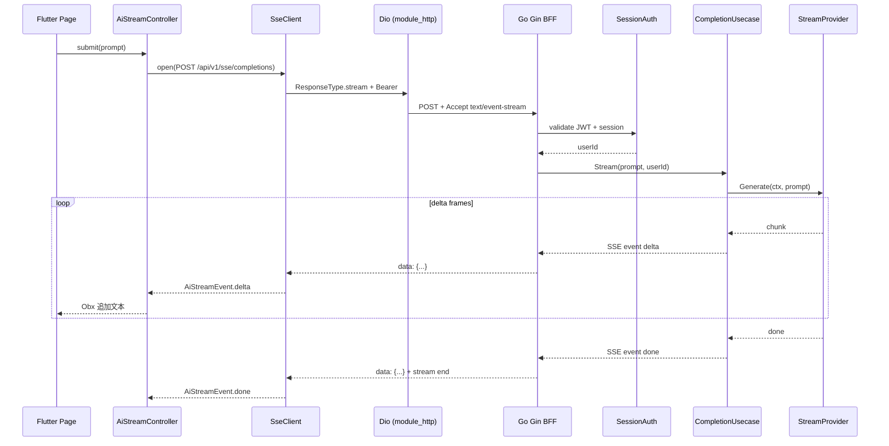

# SSE 流式输出设计（Flutter ↔ Go BFF）

> **状态**：Accepted（与 grill 定案 / ADR 0005 / `.scratch/ai-little-stone/SPEC.md` 对齐）  
> **日期**：2026-09-20  
> **关联仓库**：Flutter `my_ai_project` · Go BFF [`my_go_study`](../../my_code_study/my_go_study)  
> **产品语境**：[AI 小石头](./contexts/ai-little-stone/CONTEXT.md)  
> **ADR**：[0005](./adr/0005-sse-visit-conversation-not-realtime-im.md)  
> **对照实现**：Realtime WS 协议见 Go 仓 [`docs/realtime-websocket.md`](../../my_code_study/my_go_study/docs/realtime-websocket.md)

本文给出一套可直接落地的 **Server-Sent Events（SSE）** 方案：服务端按 token/块推送，客户端在 **AI 小石头** 助手页以气泡增量渲染流式纯文本。协议与 **停留会话**、鉴权、错误、取消、代理缓冲、分层落点与验收清单按现有 BFF / `module_http` 约定写死；与 Realtime WebSocket / 融云 IM **分离**（ADR 0005）。

---

## 0. 结论摘要

| 决策 | 选择 |
|------|------|
| 产品入口 | 首页「客户管理」→ **AI小石头**；须登录；`module_ai` 气泡客服页 |
| 传输 | **HTTP SSE**（`Content-Type: text/event-stream`） |
| 方法 | **`POST /api/v1/sse/completions`**（Bearer；首句无 `conversationId`，`meta` 下发） |
| 停留会话 | Redis **30 分钟滑动 TTL**；上下文 **10 轮**；**离开页丢弃** id；不跨次续聊 |
| 鉴权 | **Session Auth**（`Authorization` + `X-Session-ID` + `X-Device-ID`） |
| 信封 | **流内帧不用 ResultModel**；流前错误 JSON `{"error":"..."}` |
| 与 Realtime / IM | **正交 / 禁用混用**（ADR 0005） |
| Flutter | `SseClient` + `module_ai`；快捷问；停止生成；单轮在途；纯文本 |
| Provider | **Mock 默认** + `openai_compatible` 配置开关 |

---

## 1. 目标与非目标

### 1.1 目标

1. 用户在某页面提交 prompt 后，同一页内看到助手回复**逐字/逐块**增长（可取消）。
2. Flutter **仅经 Go BFF** 取流；不持有上游 LLM 密钥，不直连模型厂商。
3. 协议稳定：事件名、JSON payload、结束信号、错误信号有明确契约，便于联调与回归。
4. 与现有登录态、环境切换（`AppHttpBootstrap` / LAN）、超时与取消机制一致。

### 1.2 非目标（本期不做）

| 项 | 说明 |
|----|------|
| 用 SSE 替代 Realtime | 系统通知、presence 仍走 WS |
| 浏览器原生 `EventSource` | 仅支持 GET 且难带自定义头；App 用 Dio 即可 |
| 多轮会话持久化 / RAG | 跨次续聊、知识库不在一期；**停留会话**（Redis 短时）在一期范围内 |
| 助手动作按钮 / Markdown | 一期纯文本 + 客户端快捷问 |
| 用 SSE 替代 Realtime 或写入融云 | 禁止（ADR 0005） |
| 双向流（客户端边说边上） | SSE 单向；需要双向时另开 WS 通道 |
| 把流包进 ResultModel | 禁止；会破坏增量解析 |

---

## 2. 为何选 SSE（相对 WS / 长轮询）

| 方案 | 适用 | 本场景 |
|------|------|--------|
| **SSE** | 单向、请求作用域、HTTP 中间件/鉴权复用简单 | ✅ 生成式回复 |
| WebSocket Realtime | 长连接、多 topic、双向、重连 sync | ❌ 过重；且已有独立协议 |
| 普通 JSON POST | 等整包结束 | ❌ 无流式体验 |
| gRPC stream | 服务间高性能双向流 | ❌ Flutter 主路径仍是 HTTP BFF |

原则：**「一次提问 → 一段回复流」用 SSE；「长期在线收推送」用 Realtime。**

---

## 3. 架构总览



```text
Flutter                          Go BFF (:8080)
┌─────────────────────┐          ┌──────────────────────────────┐
│ Page (GetView+Obx)  │          │ router.registerSseRoutes     │
│ AiStreamController  │  SSE     │  └ SessionAuth middleware    │
│ AiStreamRepository  │ ───────► │ controller.SseController     │
│ SseClient (commons) │ ◄─────── │ usecase.CompletionUsecase    │
│ HttpManager.dio     │  frames  │ provider.Mock / OpenAI       │
└─────────────────────┘          └──────────────────────────────┘
```

---

## 4. 协议规范

### 4.1 传输与头

**请求**

```http
POST /api/v1/sse/completions HTTP/1.1
Host: 127.0.0.1:8080
Authorization: Bearer <supabase_or_local_access_token>
X-Session-ID: <session_id>
X-Device-ID: <device_id>
Content-Type: application/json
Accept: text/event-stream
X-App-Env: test
```

**成功响应头（流开始前立刻写出）**

```http
HTTP/1.1 200 OK
Content-Type: text/event-stream; charset=utf-8
Cache-Control: no-cache, no-transform
Connection: keep-alive
X-Accel-Buffering: no
```

说明：

- `X-Accel-Buffering: no`：提示 Nginx 关闭代理缓冲，否则客户端会「攒一大块才刷」。
- 禁止 `Content-Length`（chunked 由 HTTP 层处理）。
- CORS（若 Web 调试）：需允许 `Authorization`；流式场景 Flutter 原生不受 CORS 限制。

### 4.2 请求体

```json
{
  "prompt": "二手车入口在哪里？",
  "conversationId": null,
  "clientRequestId": "req_1726800000000",
  "options": {
    "model": "mock-v1",
    "temperature": 0.7,
    "maxTokens": 1024
  }
}
```

| 字段 | 类型 | 必填 | 说明 |
|------|------|------|------|
| `prompt` | string | 是 | 用户输入；服务端做长度上限（建议 ≤ 8KiB） |
| `conversationId` | string \| null | 否 | **首句省略**；服务端在 `meta` 下发。后续必带；过期/未知 → 可恢复错误 |
| `clientRequestId` | string | 否 | 客户端幂等/日志关联；服务端回显到 `meta` |
| `options.model` | string | 否 | 默认配置模型；未知模型返回流前 400 |
| `options.temperature` | number | 否 | 透传 Provider；Mock 可忽略 |
| `options.maxTokens` | int | 否 | 上限；服务端再 clamp |

停留会话：Redis 滑动 TTL 默认 1800s；上下文最近 10 轮；离开助手页客户端丢弃 id。

### 4.3 SSE 帧格式

遵循 [WHATWG SSE](https://html.spec.whatwg.org/multipage/server-sent-events.html)：

```text
event: <name>\n
data: <json>\n
\n
```

- 每一逻辑事件：**一个** `event` 行 + **一行** `data`（JSON 单行，禁止多行 data 拼接除非明确转义）。
- 帧之间空行分隔。
- 可选 `id:`（建议用单调 `seq`）便于日志；Flutter 一期可不做 Last-Event-ID 重放。
- 可选注释行 `: keepalive\n\n` 做空闲心跳（建议每 15s，防中间设备断开）。

### 4.4 事件类型与 payload

统一 `data` JSON 形态：

```json
{
  "requestId": "sse_01HZY…",
  "seq": 1,
  "type": "delta",
  "text": "模块",
  "finishReason": null,
  "error": null
}
```

| `event` 名 | `type` 字段 | 含义 | 客户端行为 |
|------------|-------------|------|------------|
| `meta` | `meta` | 流已接受，返回服务端 `requestId`、模型名 | 记录 id；可显示「生成中」 |
| `delta` | `delta` | 增量文本，`text` 为本次追加片段 | **追加**到缓冲区 |
| `done` | `done` | 正常结束；`text` 可为空；`finishReason`=`stop`/`length` | 结束 loading；保留全文 |
| `error` | `error` | 流中失败；`error.code` / `error.message` | 结束 loading；展示错误；**不再**等 done |
| （注释） | — | `: keepalive` | 忽略 |

**`meta` 示例**

```text
event: meta
data: {"requestId":"sse_01HZY","seq":0,"type":"meta","conversationId":"conv_01HZY","model":"mock-v1","clientRequestId":"req_1726800000000"}

```

**`delta` 示例**

```text
event: delta
data: {"requestId":"sse_01HZY","seq":1,"type":"delta","text":"本项目"}

```

**`done` 示例**

```text
event: done
data: {"requestId":"sse_01HZY","seq":42,"type":"done","text":"","finishReason":"stop"}

```

**`error` 示例（流已开始后）**

```text
event: error
data: {"requestId":"sse_01HZY","seq":10,"type":"error","error":{"code":"upstream_timeout","message":"model upstream timeout"}}

```

### 4.5 流前错误（未升级为 SSE）

鉴权失败、参数错误等在**写出 SSE 头之前**返回普通 JSON（与 Realtime / Backend 一致）：

```http
HTTP/1.1 401 Unauthorized
Content-Type: application/json

{"error":"unauthorized"}
```

| HTTP | 场景 |
|------|------|
| 400 | prompt 空、超长、非法 options |
| 401 | 无/无效 token |
| 403 | session 无效 / 设备不匹配 |
| 404 | 未知路径 |
| 429 | 限流 |
| 503 | Provider 未配置或不可用 |

**一旦开始写 `text/event-stream`，后续错误必须走 `event: error`，不得中途改成 JSON 信封。**

### 4.6 取消与断开

| 方 | 行为 |
|----|------|
| 客户端 | 取消 Dio `CancelToken` / 关闭响应流 → TCP 断开 |
| 服务端 | `Request.Context().Done()` 取消 Provider；停止写帧；打日志 `canceled` |
| 客户端 UI | dispose / 点「停止」→ cancel；缓冲区保留已生成内容 |

不要求服务端再推 `done`（连接已断）。

### 4.7 与 ResultModel 的边界

| 接口类型 | 格式 |
|----------|------|
| 登录、二手车等 JSON API | `{ code, message, data, timestamp }` 或 Backend JSON |
| Realtime HTTP | 直接 JSON / `{"error"}` |
| **SSE 流** | **仅** SSE 帧；**禁止** ResultModel |

---

## 5. Go BFF 设计（my_go_study）

### 5.1 路由与中间件

文件建议：

| 文件 | 职责 |
|------|------|
| `internal/delivery/http/router/sse_routes.go` | 注册路由 |
| `internal/delivery/http/controller/sse_controller.go` | 写 SSE 头、循环 Flush |
| `internal/usecase/completion_usecase.go` | 编排 requestId、限流、调用 Provider |
| `internal/domain/entity/sse_event.go` | 事件结构 |
| `internal/domain/provider/stream_provider.go` | Provider 接口 |
| `internal/repository/llm/mock_stream_provider.go` | 一期 Mock |
| `internal/repository/llm/openai_compatible_provider.go` | 二期 |
| `pkg/config` + `configs/config.yaml` | `sse.*` 配置 |
| `cmd/api/main.go` | DI 装配 |

路由（对齐 `registerRealtimeRoutes`）：

```go
func registerSseRoutes(v1 *gin.RouterGroup, sessionAuth gin.HandlerFunc, ctrl *controller.SseController) {
	g := v1.Group("/sse")
	g.Use(sessionAuth)
	{
		g.POST("/completions", ctrl.Completions)
	}
}
```

在 `router.Setup` 中于 Realtime 旁注册；条件与 transactions 相同：`businessAuth && sessionAuth != nil`。

### 5.2 Controller 伪代码（正式约束）

```go
func (ctrl *SseController) Completions(c *gin.Context) {
	var req dto.CompletionRequest
	if err := c.ShouldBindJSON(&req); err != nil {
		response.BackendError(c, http.StatusBadRequest, "invalid request")
		return
	}
	userID := middleware.UserIDFromContext(c) // 与现有 session 中间件一致

	c.Writer.Header().Set("Content-Type", "text/event-stream; charset=utf-8")
	c.Writer.Header().Set("Cache-Control", "no-cache, no-transform")
	c.Writer.Header().Set("Connection", "keep-alive")
	c.Writer.Header().Set("X-Accel-Buffering", "no")
	c.Writer.WriteHeader(http.StatusOK)

	flusher, ok := c.Writer.(http.Flusher)
	if !ok {
		// 极端情况：无法流式
		return
	}

	ch, err := ctrl.uc.Stream(c.Request.Context(), userID, req)
	if err != nil {
		writeSSE(c, "error", errorPayload(err))
		flusher.Flush()
		return
	}

	ticker := time.NewTicker(15 * time.Second)
	defer ticker.Stop()

	for {
		select {
		case <-c.Request.Context().Done():
			return
		case <-ticker.C:
			_, _ = c.Writer.Write([]byte(": keepalive\n\n"))
			flusher.Flush()
		case ev, ok := <-ch:
			if !ok {
				return
			}
			writeSSE(c, ev.Event, ev.Data)
			flusher.Flush()
			if ev.Event == "done" || ev.Event == "error" {
				return
			}
		}
	}
}
```

`writeSSE` 必须：

1. `json.Marshal` 为**单行**；
2. 格式 `event: %s\ndata: %s\n\n`；
3. 每次 `Flush()`。

### 5.3 Provider 接口

```go
type StreamProvider interface {
	// Stream 向 out 发送纯文本增量；ctx 取消时立即返回。
	Stream(ctx context.Context, in CompletionInput, out chan<- string) (finishReason string, err error)
}
```

- Usecase 负责把 `string` 包成 `delta` / `done` / `error` 事件并分配 `seq`。
- Mock：按 rune 或词切分，`time.Sleep(30~80ms)`，便于 UI 验证。
- OpenAI 兼容：读上游 SSE/`data: [DONE]`，转发 content delta；密钥只放 Go `configs` / env。

### 5.4 配置（`configs/config.yaml`）

```yaml
sse:
  enabled: true
  provider: mock          # mock | openai_compatible
  maxPromptBytes: 8192
  maxTokens: 2048
  keepaliveSeconds: 15
  requestTimeoutSeconds: 120
  rateLimitPerUserPerMinute: 20
  openai:
    baseUrl: "https://api.openai.com/v1"
    model: "gpt-4o-mini"
    # apiKey 仅环境变量 SSE_OPENAI_API_KEY
```

### 5.5 限流与安全

1. **按 userId** 令牌桶 / 滑动窗口（可用 Redis，对齐 session 存储）。
2. Prompt 长度、`maxTokens` clamp。
3. 日志：`requestId`、`userId`、`model`、字节数、耗时、取消标记；**不**记录完整 prompt 到明文 info（可 debug 采样）。
4. 上游错误映射为稳定 `error.code`（`upstream_timeout` / `upstream_4xx` / `provider_unavailable`）。

### 5.6 部署注意

| 层 | 要求 |
|----|------|
| Gin | 不要对 SSE 路由包会缓冲整包 body 的中间件 |
| Nginx | `proxy_buffering off;` 或依赖响应头 `X-Accel-Buffering: no`；`proxy_read_timeout` ≥ 120s |
| 负载均衡 | 粘性非必须（单次请求内完成）；超时要够长 |
| K8s Ingress | 关闭 response buffering；调大 read timeout |

---

## 6. Flutter 客户端设计（my_ai_project）

### 6.1 包与分层

| 层 | 建议路径 | 说明 |
|----|----------|------|
| SSE 基建 | `commons/network/lib/sse/sse_client.dart` | 解析帧、暴露 `Stream<SseFrame>` |
| 帧模型 | `commons/network/lib/sse/sse_frame.dart` | `event` / `data` / `id` |
| Feature | `features/ai/` → `module_ai` | 一期可先放 home 调试，稳定后独立 |
| Api | `features/ai/lib/ai/api/ai_sse_api.dart` | 路径与 body |
| Repository | `features/ai/lib/ai/repository/ai_stream_repository.dart` | 解包为领域事件 |
| Controller | `features/ai/lib/ai/controller/ai_stream_controller.dart` | GetX obs |
| Page | `features/ai/lib/ai/view/ai_stream_page.dart` | 流式展示页 |
| 路由 | `RoutePath.aiStream` + `AiModule.routes()` | 例如 `/ai/stream` |
| 入口 | 首页「全部服务」或设置调试 | 登录守卫与二手车一致 |

**禁止**：在 `bfui`、`components` 里写业务 SSE 页；`SseClient` 可放 `commons/network`（仅协议，无业务文案）。

### 6.2 为何不能用现有 `HttpManager.request`

当前默认：

- `ResponseType.json`
- `receiveTimeout: 15s`
- `Accept: application/json`（`AuthHeaderProvider`）
- 完整 body → `BackendResponseParser`

SSE 必须：

```dart
final response = await HttpManager.instance.dio.post<ResponseBody>(
  '/api/v1/sse/completions',
  data: body,
  options: Options(
    responseType: ResponseType.stream,
    receiveTimeout: Duration.zero, // 或 ≥ 配置的 requestTimeout
    sendTimeout: const Duration(seconds: 30),
    headers: {
      Headers.acceptHeader: 'text/event-stream',
      // Authorization / session 仍由 HeaderInterceptor + AuthHeaderProvider 注入
    },
    validateStatus: (s) => s != null && s < 600,
  ),
  cancelToken: cancelToken,
);
```

流前 4xx：`response.data` 可能是短 JSON —— `SseClient` 在 `statusCode != 200` 或 `content-type` 非 event-stream 时读完 body 解析 `error` 并抛 typed 异常。

### 6.3 SSE 解析器

按字节流切行，状态机维护当前 `event` / `data` / `id`；遇空行 emit 一帧。

要点：

1. 使用 `utf8.decoder.bind(byteStream)` 再 `LineSplitter`（或手写缓冲，避免多字节字符切断）。
2. 忽略以 `:` 开头的注释行。
3. 同帧多行 `data:` 按规范用 `\n` 拼接（本协议约束服务端只发单行，客户端仍兼容）。
4. `CancelToken` cancel 时关闭订阅，不再向上游 yield。

```dart
sealed class AiStreamEvent {
  const AiStreamEvent();
}
class AiStreamMeta extends AiStreamEvent { /* requestId, model */ }
class AiStreamDelta extends AiStreamEvent { final String text; }
class AiStreamDone extends AiStreamEvent { final String? finishReason; }
class AiStreamError extends AiStreamEvent { final String code; final String message; }
```

Repository 将 `SseFrame` JSON decode → `AiStreamEvent`；非法帧记日志并跳过或升为 error。

### 6.4 Controller（GetX）

遵循项目 Obx 规范：

```dart
class AiStreamController extends GetxController {
  final text = ''.obs;
  final status = AiStreamStatus.idle.obs; // idle|streaming|done|error
  final errorMessage = RxnString();
  CancelToken? _token;

  Future<void> submit(String prompt) async {
    await stop();
    text.value = '';
    status.value = AiStreamStatus.streaming;
    _token = CancelToken();
    try {
      await for (final ev in repository.streamCompletion(prompt, cancelToken: _token!)) {
        switch (ev) {
          case AiStreamDelta(:final text):
            this.text.value += text;
          case AiStreamDone():
            status.value = AiStreamStatus.done;
          case AiStreamError(:final message):
            errorMessage.value = message;
            status.value = AiStreamStatus.error;
          case AiStreamMeta():
            break;
        }
      }
    } on DioException catch (e) {
      if (CancelToken.isCancel(e)) {
        status.value = text.value.isEmpty ? AiStreamStatus.idle : AiStreamStatus.done;
      } else {
        errorMessage.value = e.message;
        status.value = AiStreamStatus.error;
      }
    }
  }

  Future<void> stop() async {
    _token?.cancel('user_stop');
    _token = null;
  }

  @override
  void onClose() {
    _token?.cancel('dispose');
    super.onClose();
  }
}
```

### 6.5 页面 UI（当前页流式展示）

结构建议（单一职责，非卡片堆砌）：

1. 顶部 `AppNavBar`：标题「AI 流式」+ 停止按钮（仅 `streaming` 可见）。
2. 中部：可滚动展示区，绑定 `Obx` 读 `controller.text.value`；流式时自动 `ScrollController` 贴底。
3. 底部：输入框 + 发送；`streaming` 时禁用发送或改为停止。
4. 状态：`streaming` 显示细进度/光标闪烁；`error` 用明确错误文案 + 重试。

```dart
class AiStreamPage extends GetView<AiStreamController> {
  @override
  Widget build(BuildContext context) {
    return AppPageScaffold(
      title: 'AI 流式',
      body: Column(
        children: [
          Expanded(
            child: Obx(() {
              final content = controller.text.value;
              final status = controller.status.value;
              if (status == AiStreamStatus.idle && content.isEmpty) {
                return const Center(child: Text('输入问题后开始生成'));
              }
              return SingleChildScrollView(
                controller: controller.scrollController,
                padding: const EdgeInsets.all(16),
                child: SelectableText(content.isEmpty ? '…' : content),
              );
            }),
          ),
          // 输入区 …
        ],
      ),
    );
  }
}
```

Obx **内部**必须读 `.value`；加载中禁用空 `SizedBox.shrink()`。

鉴权入口：

```dart
if (AuthSession.isLoggedIn) {
  await Get.toNamed(RoutePath.aiStream);
} else {
  await AuthNavigation.openLogin(redirectRoute: RoutePath.aiStream);
}
```

### 6.6 模块注册

1. `features/ai/pubspec.yaml`：依赖 `module_core` / `module_http` / `module_common_ui` / `wys_router` / `get`。
2. 根 `pubspec.yaml` path 依赖。
3. `lib/config/module_manifest.dart` 注册 `AiModule`。
4. `RoutePath` 增加常量。

---

## 7. 错误码与客户端映射

| 来源 | code | UI |
|------|------|-----|
| HTTP 401/403 | — | 引导重新登录 |
| HTTP 429 | — | 「请求过于频繁」 |
| HTTP 503 | — | 「服务暂不可用」 |
| SSE `upstream_timeout` | 流中 error | Toast + 保留已生成文本 |
| SSE `provider_unavailable` | 流中 error | 同上 |
| 用户取消 | — | 静默；保留文本 |

---

## 8. 联调与验收

### 8.1 curl（流前需登录）

```bash
TOKEN=$(curl -sf -X POST http://127.0.0.1:8080/api/v1/user/login \
  -H "Content-Type: application/json" \
  -d '{"username":"your@email.com","password":"yourpass"}' \
  | python3 -c "import sys,json; print(json.load(sys.stdin)['data']['token'])")

curl -N -X POST http://127.0.0.1:8080/api/v1/sse/completions \
  -H "Authorization: Bearer $TOKEN" \
  -H "Content-Type: application/json" \
  -H "Accept: text/event-stream" \
  -d '{"prompt":"你好，做个自我介绍","clientRequestId":"curl_1"}'
```

期望：先看到 `event: meta`，再连续 `delta`，最后 `done`；`-N` 关闭 curl 缓冲。

### 8.2 验收清单

- [ ] 未登录 → 401 JSON，非 SSE
- [ ] 合法请求 → 首包 1s 内出现首 delta（Mock）
- [ ] 页面文本单调递增，无整包闪烁替换（除非 intentionally rebuild）
- [ ] 点停止 / 退出页 → 服务端 goroutine 结束（日志 `canceled`）
- [ ] 上游故意超时 → `event: error`，UI 可恢复
- [ ] 环境切换后 baseUrl 正确（含 Android `10.0.2.2` / LAN `BACKEND_HOST`）
- [ ] Nginx/反代下仍能逐块到达（验证 `X-Accel-Buffering`）
- [ ] 单元测试：SSE 行解析（多帧、keepalive、残缺行）
- [ ] Usecase 测试：ctx cancel 不再向 channel 写

### 8.3 建议测试文件

| 侧 | 文件 |
|----|------|
| Go | `internal/delivery/http/controller/sse_controller_test.go`（httptest + 读流） |
| Go | `internal/repository/llm/mock_stream_provider_test.go` |
| Flutter | `commons/network/test/sse_parser_test.dart` |
| Flutter | `features/ai/test/ai_stream_controller_test.dart`（fake stream） |

---

## 9. 实施分期

### Phase 0 — 契约冻结（0.5d）

- 本文件评审通过；Go/Flutter 事件 JSON schema 定稿。

### Phase 1 — Mock 打通（2~3d）

1. Go：`registerSseRoutes` + MockProvider + 限流骨架。  
2. Flutter：`SseClient` + 解析测试 + `AiStreamPage`。  
3. curl + 真机/模拟器验收清单勾选。

### Phase 2 — 生产 Provider（2~4d）

1. OpenAI 兼容 Provider + 密钥配置。  
2. 更严限流、超时、观测（requestId 指标）。  
3. 可选：`conversationId` 与简单历史。

### Phase 3 — 体验（按需）

- Markdown 增量渲染、代码块、引用；重试/重新生成；分享。

---

## 10. 文件落点速查

**Go (`my_go_study`)**

```text
internal/delivery/http/router/sse_routes.go
internal/delivery/http/controller/sse_controller.go
internal/delivery/http/dto/request/sse_completion.go
internal/usecase/completion_usecase.go
internal/domain/entity/sse_event.go
internal/domain/provider/stream_provider.go
internal/repository/llm/mock_stream_provider.go
configs/config.yaml                    # sse: 段
cmd/api/main.go                        # 装配
docs/sse-streaming.md                  # 可摘协议副本（可选）
```

**Flutter (`my_ai_project`)**

```text
commons/network/lib/sse/sse_client.dart
commons/network/lib/sse/sse_parser.dart
commons/network/lib/sse/sse_frame.dart
commons/network/lib/module_http.dart    # export
features/ai/lib/ai_module.dart
features/ai/lib/ai/api/ai_sse_api.dart
features/ai/lib/ai/repository/ai_stream_repository.dart
features/ai/lib/ai/controller/ai_stream_controller.dart
features/ai/lib/ai/view/ai_stream_page.dart
commons/wys_router/.../route_path.dart
lib/config/module_manifest.dart
docs/sse-streaming-design.md           # 本文（权威）
```

---

## 11. ADR 建议（实施前可补）

**标题**：采用 HTTP SSE 做请求作用域生成流，与 Realtime WS 分离  

**决策**：

1. 生成式单向流用 `POST /api/v1/sse/completions` + SSE 帧。  
2. 鉴权复用 Session Auth；不采用 query ticket（除非未来 Web EventSource）。  
3. 流帧不使用 ResultModel。  
4. Flutter 在 `module_http` 增加流式客户端，业务在 `module_ai`。

**后果**：需单独处理超时、代理缓冲、取消；与现有 JSON `HttpManager.request` 双轨并存。

---

## 12. 参考

- WHATWG Server-Sent Events  
- 本仓库 [BACKEND_INTEGRATION.md](./BACKEND_INTEGRATION.md)  
- Go [realtime-websocket.md](../../my_code_study/my_go_study/docs/realtime-websocket.md)（鉴权与「直接 JSON / 非 ResultModel」对照）  
- Go [grpc/gin-http-vs-grpc.md](../../my_code_study/my_go_study/docs/grpc/gin-http-vs-grpc.md)（HTTP 流式选项表）  
- AGENTS.md：GetX Obx、HTTP 分层、目录边界  

---

## 修订记录

| 日期 | 说明 |
|------|------|
| 2026-09-20 | 初版：协议、Go/Flutter 落点、Mock 分期、验收清单 |
